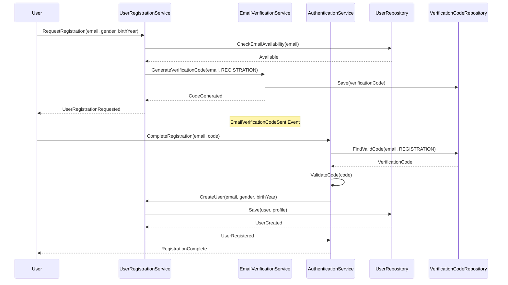
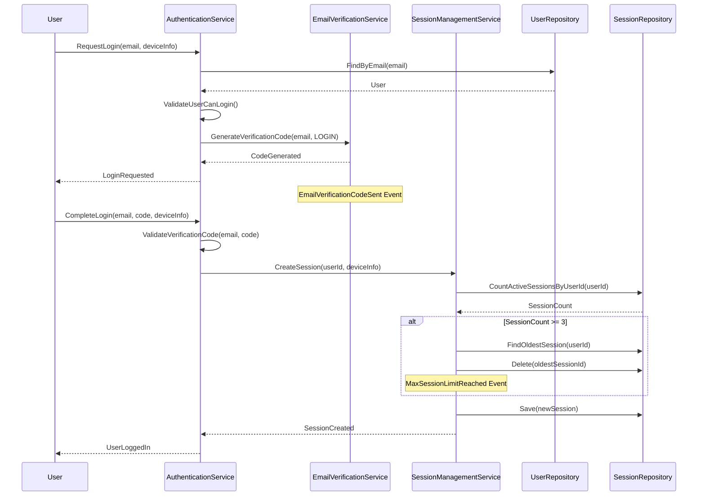
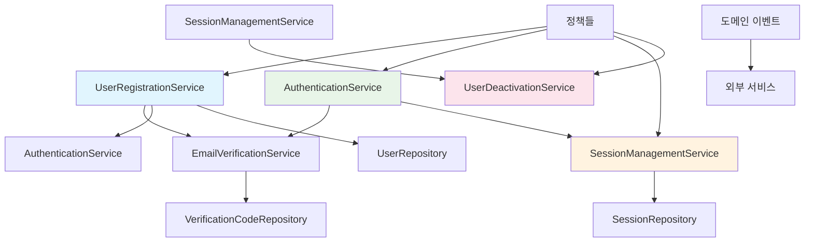

# Unit1: Authentication & Profile Management - Domain Model

## 1. 도메인 분석 및 이해

### 1.1 핵심 비즈니스 규칙

#### 사용자 등록 (US-017)
- 이메일 주소는 유일해야 함 (중복 가입 불가)
- 성별은 선택사항 (남성/여성/선택안함)
- 출생년도는 선택사항 (4자리 숫자)
- 이메일 인증 코드 발송 필수
- 인증 코드 입력으로 가입 완료
- **인증 코드 유효시간: 15분**

#### 사용자 로그인 (US-018)
- 등록된 이메일로만 로그인 가능
- 이메일 인증 코드 방식 사용
- 로그인 상태 유지: 마지막 사용 시간으로부터 7일
- 웹앱 사용 시 자동 세션 연장

#### 세션 관리 (US-024)
- **동시 로그인 제한: 최대 3개 세션**
- 3개 초과 시 유효기간이 짧은 기존 세션 자동 종료
- 웹앱 액션 수행 시 세션 자동 연장
- 비활성 7일 후 자동 로그아웃

#### 로그아웃 (US-019)
- 명시적 로그아웃 시 세션 완전 종료
- 로그인 페이지로 리다이렉트

#### 회원 탈퇴 (US-020)
- 탈퇴 전 확인 절차 필수
- **데이터 보관 정책: 1년 후 완전 삭제**
- 탈퇴 시 모든 개인 데이터 비활성화

#### 프로필 관리 (US-022, US-023)
- 언어 설정: 한국어/영어 선택
- 성별, 출생년도 수정 가능
- 변경사항 즉시 저장

### 1.2 도메인 전문가 언어 (Ubiquitous Language)

#### 핵심 용어 정의
- **User**: 시스템에 등록된 사용자
- **Email**: 사용자 식별자이자 인증 수단
- **VerificationCode**: 이메일로 발송되는 6자리 인증 코드
- **Session**: 사용자의 로그인 상태를 나타내는 세션
- **Profile**: 사용자의 개인 정보 (성별, 출생년도, 언어 설정)
- **Registration**: 신규 사용자 가입 프로세스
- **Authentication**: 기존 사용자 로그인 프로세스
- **Deactivation**: 회원 탈퇴 처리 (즉시 삭제가 아닌 비활성화)
- **SessionLimit**: 동시 로그인 세션 수 제한 (최대 3개)
- **SessionExtension**: 웹앱 사용 시 세션 유효기간 자동 연장
- **DataRetention**: 탈퇴 후 데이터 보관 정책 (1년)

### 1.3 바운디드 컨텍스트 경계

#### Authentication & Profile Management Context
**책임 범위:**
- 사용자 등록 및 인증
- 세션 생명주기 관리
- 프로필 정보 관리
- 계정 비활성화 및 데이터 보관

**외부 의존성:**
- 이메일 발송 서비스 (인증 코드 전송)
- 다른 바운디드 컨텍스트와의 사용자 식별자 공유

## 2. 애그리게이트 설계

### 2.1 핵심 엔티티 식별

#### User (사용자)
- **역할**: 시스템의 주요 사용자 엔티티
- **식별자**: UserId (UUID)
- **핵심 속성**: Email, Status, CreatedAt, LastActiveAt

#### Profile (프로필)
- **역할**: 사용자의 개인 정보 관리
- **식별자**: ProfileId (UUID)
- **핵심 속성**: Gender, BirthYear, Language, UserId

#### Session (세션)
- **역할**: 사용자 로그인 상태 관리
- **식별자**: SessionId (UUID)
- **핵심 속성**: UserId, DeviceInfo, ExpiresAt, LastAccessedAt

#### VerificationCode (인증 코드)
- **역할**: 이메일 인증 프로세스 관리
- **식별자**: CodeId (UUID)
- **핵심 속성**: Email, Code, Purpose, ExpiresAt, IsUsed

### 2.2 애그리게이트 루트 결정

#### User Aggregate
- **애그리게이트 루트**: User
- **포함 엔티티**: User, Profile
- **책임**: 사용자 등록, 프로필 관리, 계정 상태 관리

#### Session Aggregate  
- **애그리게이트 루트**: Session
- **포함 엔티티**: Session
- **책임**: 세션 생성, 연장, 만료, 동시 로그인 제한 관리

#### VerificationCode Aggregate
- **애그리게이트 루트**: VerificationCode
- **포함 엔티티**: VerificationCode
- **책임**: 인증 코드 생성, 검증, 만료 관리

### 2.3 애그리게이트 경계 정의

#### User Aggregate 경계
- User와 Profile은 강한 일관성 필요 (동일 트랜잭션)
- 사용자 정보 변경 시 Profile도 함께 관리
- 계정 비활성화 시 Profile도 함께 처리

#### Session Aggregate 경계
- 각 Session은 독립적으로 관리
- 동시 로그인 제한은 도메인 서비스에서 처리
- Session 간 직접적인 의존성 없음

#### VerificationCode Aggregate 경계
- 각 인증 코드는 독립적 생명주기
- 일회성 사용 후 무효화
- 시간 기반 자동 만료

### 2.4 애그리게이트 간 관계

#### User ↔ Session
- **관계**: 1:N (한 사용자가 여러 세션 보유 가능)
- **참조 방식**: Session이 UserId로 User 참조
- **일관성**: 최종 일관성 (Eventually Consistent)

#### User ↔ VerificationCode  
- **관계**: 1:N (한 사용자가 여러 인증 코드 보유 가능)
- **참조 방식**: VerificationCode가 Email로 User 참조
- **일관성**: 최종 일관성

## 3. 엔티티 및 값 객체 설계

### 3.1 User 엔티티

#### 속성
- **UserId**: UUID (식별자)
- **Email**: Email 값 객체
- **Status**: UserStatus 열거형 (ACTIVE, DEACTIVATED, PENDING_DELETION)
- **CreatedAt**: DateTime
- **LastActiveAt**: DateTime
- **DeactivatedAt**: DateTime (nullable)

#### 행동 (메서드)
- **Register()**: 사용자 등록
- **Activate()**: 계정 활성화
- **Deactivate()**: 계정 비활성화
- **UpdateLastActivity()**: 마지막 활동 시간 업데이트
- **CanLogin()**: 로그인 가능 여부 확인

### 3.2 Profile 엔티티

#### 속성
- **ProfileId**: UUID (식별자)
- **UserId**: UUID (User 참조)
- **Gender**: Gender 값 객체
- **BirthYear**: BirthYear 값 객체
- **Language**: Language 열거형 (KOREAN, ENGLISH)
- **UpdatedAt**: DateTime

#### 행동 (메서드)
- **UpdateGender()**: 성별 정보 수정
- **UpdateBirthYear()**: 출생년도 수정
- **UpdateLanguage()**: 언어 설정 변경

### 3.3 Session 엔티티

#### 속성
- **SessionId**: UUID (식별자)
- **UserId**: UUID (User 참조)
- **DeviceInfo**: DeviceInfo 값 객체
- **CreatedAt**: DateTime
- **ExpiresAt**: DateTime
- **LastAccessedAt**: DateTime
- **IsActive**: Boolean

#### 행동 (메서드)
- **Extend()**: 세션 연장
- **Expire()**: 세션 만료
- **IsExpired()**: 만료 여부 확인
- **UpdateLastAccess()**: 마지막 접근 시간 업데이트

### 3.4 VerificationCode 엔티티

#### 속성
- **CodeId**: UUID (식별자)
- **Email**: Email 값 객체
- **Code**: VerificationCode 값 객체
- **Purpose**: CodePurpose 열거형 (REGISTRATION, LOGIN)
- **CreatedAt**: DateTime
- **ExpiresAt**: DateTime
- **IsUsed**: Boolean
- **UsedAt**: DateTime (nullable)

#### 행동 (메서드)
- **Verify()**: 코드 검증
- **MarkAsUsed()**: 사용 완료 표시
- **IsExpired()**: 만료 여부 확인
- **IsValid()**: 유효성 검사

### 3.5 값 객체 설계

#### Email 값 객체
- **속성**: Value (string)
- **검증**: 이메일 형식 유효성 검사
- **불변성**: 생성 후 변경 불가

#### VerificationCode 값 객체
- **속성**: Value (string, 6자리 숫자)
- **생성**: 랜덤 6자리 숫자 생성
- **불변성**: 생성 후 변경 불가

#### Gender 값 객체
- **속성**: Value (MALE, FEMALE, NOT_SPECIFIED)
- **검증**: 유효한 성별 값 확인
- **불변성**: 생성 후 변경 불가

#### BirthYear 값 객체
- **속성**: Value (int, 4자리)
- **검증**: 1900-현재년도 범위 확인
- **불변성**: 생성 후 변경 불가

#### DeviceInfo 값 객체
- **속성**: UserAgent (string), IpAddress (string)
- **목적**: 세션 식별 및 보안
- **불변성**: 생성 후 변경 불가

### 3.6 열거형 정의

#### UserStatus
- ACTIVE: 활성 사용자
- DEACTIVATED: 비활성화된 사용자
- PENDING_DELETION: 삭제 대기 중 (1년 보관)

#### CodePurpose
- REGISTRATION: 회원가입 인증
- LOGIN: 로그인 인증

#### Language
- KOREAN: 한국어
- ENGLISH: 영어

### 3.7 엔티티 간 연관관계

#### User ↔ Profile
- **관계**: 1:1 (필수)
- **소유**: User가 Profile 소유
- **생명주기**: User 생성 시 Profile 자동 생성

#### User ↔ Session
- **관계**: 1:N (선택적)
- **참조**: Session이 UserId로 User 참조
- **제약**: 최대 3개 활성 세션

## 4. 도메인 이벤트 설계

### 4.1 사용자 등록 관련 이벤트

#### UserRegistrationRequested
- **발생 시점**: 사용자가 회원가입을 요청할 때
- **데이터**: Email, Gender, BirthYear, RequestedAt
- **목적**: 이메일 인증 코드 발송 트리거

#### EmailVerificationCodeSent
- **발생 시점**: 인증 코드가 이메일로 발송될 때
- **데이터**: Email, CodeId, SentAt
- **목적**: 인증 코드 발송 로깅 및 추적

#### UserRegistered
- **발생 시점**: 인증 코드 검증 후 사용자 등록 완료
- **데이터**: UserId, Email, ProfileId, RegisteredAt
- **목적**: 다른 바운디드 컨텍스트에 사용자 생성 알림

#### EmailVerificationFailed
- **발생 시점**: 잘못된 인증 코드 입력 시
- **데이터**: Email, AttemptedCode, FailedAt, AttemptCount
- **목적**: 보안 모니터링 및 계정 보호

### 4.2 인증 관련 이벤트

#### LoginRequested
- **발생 시점**: 사용자가 로그인을 요청할 때
- **데이터**: Email, DeviceInfo, RequestedAt
- **목적**: 로그인 인증 코드 발송 트리거

#### UserLoggedIn
- **발생 시점**: 인증 코드 검증 후 로그인 성공
- **데이터**: UserId, SessionId, DeviceInfo, LoggedInAt
- **목적**: 세션 생성 및 활동 로깅

#### UserLoggedOut
- **발생 시점**: 사용자가 명시적으로 로그아웃할 때
- **데이터**: UserId, SessionId, LoggedOutAt
- **목적**: 세션 정리 및 로그아웃 로깅

#### SessionExpired
- **발생 시점**: 세션이 자동으로 만료될 때
- **데이터**: UserId, SessionId, ExpiredAt, Reason
- **목적**: 만료된 세션 정리

#### SessionExtended
- **발생 시점**: 사용자 활동으로 세션이 연장될 때
- **데이터**: UserId, SessionId, ExtendedAt, NewExpiryTime
- **목적**: 세션 연장 추적

#### MaxSessionLimitReached
- **발생 시점**: 동시 로그인 제한(3개)에 도달할 때
- **데이터**: UserId, NewSessionId, TerminatedSessionId, OccurredAt
- **목적**: 기존 세션 종료 및 보안 알림

### 4.3 프로필 관리 이벤트

#### ProfileUpdated
- **발생 시점**: 사용자가 프로필 정보를 수정할 때
- **데이터**: UserId, ProfileId, ChangedFields, UpdatedAt
- **목적**: 프로필 변경 추적 및 다른 컨텍스트 동기화

#### LanguageChanged
- **발생 시점**: 사용자가 언어 설정을 변경할 때
- **데이터**: UserId, OldLanguage, NewLanguage, ChangedAt
- **목적**: UI 언어 설정 동기화

#### UserDeactivated
- **발생 시점**: 사용자가 회원 탈퇴를 요청할 때
- **데이터**: UserId, DeactivatedAt, RetentionUntil
- **목적**: 계정 비활성화 및 데이터 보관 스케줄링

#### UserDataScheduledForDeletion
- **발생 시점**: 1년 보관 기간 만료 시
- **데이터**: UserId, ScheduledDeletionAt
- **목적**: 완전 삭제 프로세스 트리거

### 4.4 이벤트 발행 시점 및 처리 방식

#### 동기 처리 이벤트
- **UserRegistered**: 즉시 처리 (다른 컨텍스트 동기화)
- **UserLoggedIn**: 즉시 처리 (세션 생성)
- **MaxSessionLimitReached**: 즉시 처리 (기존 세션 종료)

#### 비동기 처리 이벤트
- **EmailVerificationCodeSent**: 백그라운드 처리
- **ProfileUpdated**: 백그라운드 처리
- **SessionExpired**: 배치 처리
- **UserDataScheduledForDeletion**: 스케줄링 처리

#### 이벤트 저장소
- 모든 도메인 이벤트는 이벤트 스토어에 저장
- 감사(Audit) 목적으로 영구 보관
- 이벤트 재생(Event Replay) 지원

#### 이벤트 핸들러
- **EmailService**: 인증 코드 발송 이벤트 처리
- **SessionCleanupService**: 세션 만료 이벤트 처리
- **DataRetentionService**: 데이터 보관/삭제 이벤트 처리
- **AuditService**: 모든 보안 관련 이벤트 로깅

## 5. 데이터베이스 설계 고려사항

### 5.1 PostgreSQL 선택 이유
- **ACID 트랜잭션**: User와 Profile 동시 생성/수정 시 강한 일관성 보장
- **복잡한 쿼리 지원**: 이메일 중복 체크, 세션 만료 처리 등 효율적 수행
- **JSON 컬럼 지원**: DeviceInfo 같은 반구조화 데이터 저장
- **외래키 제약조건**: 데이터 무결성 자동 보장
- **인덱스 성능**: 이메일, 세션ID 등 빠른 조회 성능

### 5.2 테이블 설계 고려사항

#### Users 테이블
- **Primary Key**: user_id (UUID)
- **Unique Index**: email
- **Index**: status, last_active_at (세션 정리용)

#### Profiles 테이블  
- **Primary Key**: profile_id (UUID)
- **Foreign Key**: user_id → users.user_id
- **Index**: user_id (1:1 관계 조회용)

#### Sessions 테이블
- **Primary Key**: session_id (UUID)
- **Foreign Key**: user_id → users.user_id
- **Index**: user_id, expires_at (동시 로그인 제한 및 만료 처리용)
- **JSON Column**: device_info

#### Verification_Codes 테이블
- **Primary Key**: code_id (UUID)
- **Index**: email, purpose, is_used (인증 코드 조회용)
- **Index**: expires_at (만료된 코드 정리용)

### 5.3 트랜잭션 경계
- **사용자 등록**: User + Profile 생성을 단일 트랜잭션으로 처리
- **로그인**: VerificationCode 검증 + Session 생성을 단일 트랜잭션으로 처리
- **세션 제한**: 기존 세션 종료 + 새 세션 생성을 단일 트랜잭션으로 처리

## 6. 도메인 서비스 설계

### 6.1 AuthenticationService (인증 서비스)

#### 책임
- 이메일 인증 코드 검증
- 로그인 프로세스 조율
- 인증 실패 처리

#### 주요 메서드
- **ValidateVerificationCode(email, code, purpose)**: 인증 코드 검증
- **AuthenticateUser(email, code)**: 사용자 인증 수행
- **HandleAuthenticationFailure(email, reason)**: 인증 실패 처리

#### 비즈니스 규칙
- 인증 코드 15분 유효성 검증
- 연속 실패 시 보안 조치
- 이미 사용된 코드 재사용 방지

### 6.2 EmailVerificationService (이메일 인증 서비스)

#### 책임
- 인증 코드 생성 및 관리
- 이메일 발송 조율
- 코드 유효성 관리

#### 주요 메서드
- **GenerateVerificationCode(email, purpose)**: 인증 코드 생성
- **SendVerificationCode(email, code)**: 이메일 발송 요청
- **InvalidateExpiredCodes()**: 만료된 코드 정리

#### 비즈니스 규칙
- 동일 목적의 미사용 코드는 1개만 유효
- 6자리 숫자 랜덤 생성
- 15분 후 자동 만료

### 6.3 SessionManagementService (세션 관리 서비스)

#### 책임
- 세션 생명주기 관리
- 동시 로그인 제한 처리
- 세션 연장 및 만료 처리

#### 주요 메서드
- **CreateSession(userId, deviceInfo)**: 새 세션 생성
- **ExtendSession(sessionId)**: 세션 연장
- **TerminateOldestSession(userId)**: 가장 오래된 세션 종료
- **CleanupExpiredSessions()**: 만료된 세션 정리

#### 비즈니스 규칙
- 최대 3개 활성 세션 제한
- 초과 시 유효기간이 짧은 세션 종료
- 웹앱 활동 시 자동 연장 (7일)

### 6.4 UserRegistrationService (사용자 등록 서비스)

#### 책임
- 사용자 등록 프로세스 조율
- 중복 가입 방지
- User-Profile 생성 조율

#### 주요 메서드
- **RegisterUser(email, gender, birthYear)**: 사용자 등록
- **CheckEmailAvailability(email)**: 이메일 중복 확인
- **CompleteRegistration(email, code)**: 등록 완료 처리

#### 비즈니스 규칙
- 이메일 유일성 보장
- User와 Profile 동시 생성
- 인증 코드 검증 후 활성화

### 6.5 UserDeactivationService (사용자 비활성화 서비스)

#### 책임
- 회원 탈퇴 처리
- 데이터 보관 정책 적용
- 관련 데이터 정리

#### 주요 메서드
- **DeactivateUser(userId)**: 사용자 비활성화
- **ScheduleDataDeletion(userId)**: 데이터 삭제 스케줄링
- **PermanentlyDeleteUser(userId)**: 완전 삭제 처리

#### 비즈니스 규칙
- 즉시 비활성화, 1년 후 완전 삭제
- 모든 활성 세션 종료
- 관련 데이터 익명화

### 6.6 도메인 서비스 간 협력

#### 로그인 플로우
1. **EmailVerificationService**: 인증 코드 생성/발송
2. **AuthenticationService**: 코드 검증
3. **SessionManagementService**: 세션 생성 및 제한 처리

#### 회원가입 플로우
1. **UserRegistrationService**: 중복 확인
2. **EmailVerificationService**: 인증 코드 발송
3. **AuthenticationService**: 코드 검증
4. **UserRegistrationService**: User-Profile 생성

#### 회원탈퇴 플로우
1. **SessionManagementService**: 모든 세션 종료
2. **UserDeactivationService**: 계정 비활성화
3. **UserDeactivationService**: 데이터 삭제 스케줄링

## 7. 정책(Policy) 설계

### 7.1 VerificationCodePolicy (인증 코드 정책)

#### 정책 규칙
- **유효 시간**: 15분
- **코드 형식**: 6자리 숫자
- **재사용 방지**: 한 번 사용된 코드는 무효화
- **동시 발급**: 동일 목적의 미사용 코드는 1개만 유효
- **생성 규칙**: 암호학적으로 안전한 랜덤 생성

#### 적용 시점
- 회원가입 인증 코드 생성 시
- 로그인 인증 코드 생성 시
- 코드 검증 시

### 7.2 SessionExpirationPolicy (세션 만료 정책)

#### 정책 규칙
- **기본 유효 기간**: 7일 (마지막 활동 기준)
- **자동 연장**: 웹앱 활동 시 7일로 재설정
- **비활성 기준**: API 호출, 페이지 이동 등 모든 사용자 액션
- **만료 처리**: 배치 작업으로 주기적 정리

#### 적용 시점
- 세션 생성 시
- 사용자 활동 감지 시
- 세션 유효성 검증 시

### 7.3 DuplicateRegistrationPolicy (중복 가입 방지 정책)

#### 정책 규칙
- **이메일 유일성**: 동일 이메일로 중복 가입 불가
- **비활성화 계정**: 비활성화된 계정도 중복 가입 불가
- **삭제 예정 계정**: 삭제 예정 계정도 중복 가입 불가
- **대소문자 구분**: 이메일 대소문자 구분하지 않음

#### 적용 시점
- 회원가입 요청 시
- 이메일 유효성 검사 시

### 7.4 AccountDeactivationPolicy (계정 비활성화 정책)

#### 정책 규칙
- **즉시 비활성화**: 탈퇴 요청 시 즉시 로그인 불가
- **데이터 보관**: 1년간 데이터 보관
- **세션 종료**: 모든 활성 세션 즉시 무효화
- **완전 삭제**: 1년 후 모든 데이터 영구 삭제

#### 적용 시점
- 회원 탈퇴 요청 시
- 데이터 보관 기간 만료 시

### 7.5 ConcurrentSessionPolicy (동시 세션 정책)

#### 정책 규칙
- **최대 세션 수**: 3개
- **초과 시 처리**: 유효기간이 가장 짧은 기존 세션 종료
- **세션 식별**: DeviceInfo로 디바이스 구분
- **동일 디바이스**: 기존 세션 갱신 (새 세션 생성 안함)

#### 적용 시점
- 새 세션 생성 시
- 세션 수 확인 시

### 7.6 SecurityPolicy (보안 정책)

#### 정책 규칙
- **인증 실패 제한**: 연속 5회 실패 시 15분 잠금
- **코드 재발송**: 1분 간격으로 제한
- **세션 하이재킹 방지**: IP 변경 시 재인증 요구
- **감사 로깅**: 모든 보안 이벤트 로깅

#### 적용 시점
- 인증 시도 시
- 세션 사용 시
- 보안 이벤트 발생 시

### 7.7 정책 적용 메커니즘

#### 정책 검증기 (Policy Validator)
- 각 정책별 독립적인 검증 로직
- 도메인 서비스에서 정책 검증기 호출
- 정책 위반 시 도메인 예외 발생

#### 정책 설정 관리
- 정책 파라미터는 설정으로 외부화
- 런타임 정책 변경 지원
- 정책 변경 이력 추적

## 8. 리포지토리 인터페이스 설계

### 8.1 UserRepository 인터페이스

#### 기본 CRUD 메서드
- **Save(user)**: 사용자 저장/수정
- **FindById(userId)**: ID로 사용자 조회
- **FindByEmail(email)**: 이메일로 사용자 조회
- **Delete(userId)**: 사용자 삭제

#### 비즈니스 특화 메서드
- **ExistsByEmail(email)**: 이메일 중복 확인
- **FindActiveUsers()**: 활성 사용자 목록 조회
- **FindDeactivatedUsers()**: 비활성화된 사용자 조회
- **FindUsersScheduledForDeletion()**: 삭제 예정 사용자 조회
- **UpdateLastActivity(userId, timestamp)**: 마지막 활동 시간 업데이트

### 8.2 SessionRepository 인터페이스

#### 기본 CRUD 메서드
- **Save(session)**: 세션 저장/수정
- **FindById(sessionId)**: ID로 세션 조회
- **Delete(sessionId)**: 세션 삭제

#### 비즈니스 특화 메서드
- **FindActiveSessionsByUserId(userId)**: 사용자의 활성 세션 조회
- **CountActiveSessionsByUserId(userId)**: 사용자의 활성 세션 수 조회
- **FindExpiredSessions()**: 만료된 세션 조회
- **DeleteExpiredSessions()**: 만료된 세션 일괄 삭제
- **FindOldestSessionByUserId(userId)**: 가장 오래된 세션 조회
- **DeleteAllSessionsByUserId(userId)**: 사용자의 모든 세션 삭제

### 8.3 VerificationCodeRepository 인터페이스

#### 기본 CRUD 메서드
- **Save(verificationCode)**: 인증 코드 저장/수정
- **FindById(codeId)**: ID로 인증 코드 조회
- **Delete(codeId)**: 인증 코드 삭제

#### 비즈니스 특화 메서드
- **FindByEmailAndPurpose(email, purpose)**: 이메일과 목적으로 조회
- **FindValidCodeByEmailAndPurpose(email, purpose)**: 유효한 코드 조회
- **FindExpiredCodes()**: 만료된 코드 조회
- **DeleteExpiredCodes()**: 만료된 코드 일괄 삭제
- **InvalidateCodesByEmailAndPurpose(email, purpose)**: 기존 코드 무효화
- **MarkAsUsed(codeId)**: 코드 사용 완료 표시

### 8.4 ProfileRepository 인터페이스

#### 기본 CRUD 메서드
- **Save(profile)**: 프로필 저장/수정
- **FindById(profileId)**: ID로 프로필 조회
- **FindByUserId(userId)**: 사용자 ID로 프로필 조회
- **Delete(profileId)**: 프로필 삭제

#### 비즈니스 특화 메서드
- **UpdateGender(userId, gender)**: 성별 정보 수정
- **UpdateBirthYear(userId, birthYear)**: 출생년도 수정
- **UpdateLanguage(userId, language)**: 언어 설정 변경

### 8.5 리포지토리 메서드 시그니처 정의

#### 반환 타입 규칙
- **단일 엔티티**: Optional<Entity> 또는 Entity (null 허용)
- **컬렉션**: List<Entity> (빈 리스트 반환)
- **존재 여부**: Boolean
- **개수**: Integer
- **저장/수정**: Entity (저장된 엔티티 반환)

#### 예외 처리 규칙
- **RepositoryException**: 데이터 접근 계층 예외
- **EntityNotFoundException**: 엔티티 미발견 시
- **DuplicateEntityException**: 중복 엔티티 생성 시
- **ConcurrencyException**: 동시성 충돌 시

#### 트랜잭션 경계
- 각 리포지토리 메서드는 단일 트랜잭션 내에서 실행
- 복합 작업은 애플리케이션 서비스에서 트랜잭션 관리
- 읽기 전용 메서드는 @Transactional(readOnly=true) 적용

### 8.6 PostgreSQL 특화 고려사항

#### 인덱스 활용
- **UserRepository**: email 컬럼 UNIQUE 인덱스 활용
- **SessionRepository**: (user_id, expires_at) 복합 인덱스 활용
- **VerificationCodeRepository**: (email, purpose, is_used) 복합 인덱스 활용

#### JSON 컬럼 처리
- **SessionRepository**: device_info JSON 컬럼 직렬화/역직렬화
- PostgreSQL JSON 연산자 활용한 쿼리 최적화

#### 배치 작업 최적화
- **DeleteExpiredSessions()**: BATCH DELETE 사용
- **DeleteExpiredCodes()**: BATCH DELETE 사용
- 대용량 데이터 처리 시 페이징 적용

### 8.7 리포지토리 구현 가이드라인

#### 성능 최적화
- N+1 쿼리 방지를 위한 JOIN 활용
- 필요한 컬럼만 SELECT (Projection)
- 적절한 페이징 및 정렬 적용

#### 데이터 일관성
- 외래키 제약조건 활용
- 트랜잭션 격리 수준 고려
- 낙관적 잠금 적용 (버전 관리)

## 9. 애플리케이션 서비스 인터페이스 설계

### 9.1 UserRegistrationApplicationService

#### 사용자 등록 유스케이스
- **RequestRegistration(email, gender, birthYear)**: 회원가입 요청
  - 입력: 이메일, 성별(선택), 출생년도(선택)
  - 출력: 등록 요청 ID, 인증 코드 발송 상태
  - 예외: DuplicateEmailException, InvalidEmailFormatException

- **CompleteRegistration(email, verificationCode)**: 회원가입 완료
  - 입력: 이메일, 인증 코드
  - 출력: 사용자 ID, 프로필 ID
  - 예외: InvalidVerificationCodeException, ExpiredCodeException

- **ResendVerificationCode(email)**: 인증 코드 재발송
  - 입력: 이메일
  - 출력: 발송 상태
  - 예외: TooManyRequestsException, UserNotFoundException

### 9.2 AuthenticationApplicationService

#### 로그인/로그아웃 유스케이스
- **RequestLogin(email, deviceInfo)**: 로그인 요청
  - 입력: 이메일, 디바이스 정보
  - 출력: 로그인 요청 ID, 인증 코드 발송 상태
  - 예외: UserNotFoundException, UserDeactivatedException

- **CompleteLogin(email, verificationCode, deviceInfo)**: 로그인 완료
  - 입력: 이메일, 인증 코드, 디바이스 정보
  - 출력: 세션 토큰, 만료 시간
  - 예외: InvalidVerificationCodeException, MaxSessionLimitException

- **Logout(sessionId)**: 로그아웃
  - 입력: 세션 ID
  - 출력: 로그아웃 상태
  - 예외: SessionNotFoundException

- **RefreshSession(sessionId)**: 세션 갱신
  - 입력: 세션 ID
  - 출력: 새로운 만료 시간
  - 예외: SessionExpiredException, SessionNotFoundException

### 9.3 ProfileManagementApplicationService

#### 프로필 관리 유스케이스
- **GetProfile(userId)**: 프로필 조회
  - 입력: 사용자 ID
  - 출력: 프로필 정보 (성별, 출생년도, 언어)
  - 예외: UserNotFoundException, ProfileNotFoundException

- **UpdateProfile(userId, gender, birthYear)**: 프로필 수정
  - 입력: 사용자 ID, 성별, 출생년도
  - 출력: 수정된 프로필 정보
  - 예외: UserNotFoundException, InvalidProfileDataException

- **ChangeLanguage(userId, language)**: 언어 설정 변경
  - 입력: 사용자 ID, 언어 설정
  - 출력: 변경된 언어 설정
  - 예외: UserNotFoundException, UnsupportedLanguageException

### 9.4 SessionManagementApplicationService

#### 세션 관리 유스케이스
- **GetActiveSessions(userId)**: 활성 세션 조회
  - 입력: 사용자 ID
  - 출력: 활성 세션 목록 (디바이스 정보, 생성 시간, 마지막 접근 시간)
  - 예외: UserNotFoundException

- **TerminateSession(userId, sessionId)**: 특정 세션 종료
  - 입력: 사용자 ID, 세션 ID
  - 출력: 종료 상태
  - 예외: SessionNotFoundException, UnauthorizedAccessException

- **TerminateAllSessions(userId)**: 모든 세션 종료
  - 입력: 사용자 ID
  - 출력: 종료된 세션 수
  - 예외: UserNotFoundException

### 9.5 UserDeactivationApplicationService

#### 계정 비활성화 유스케이스
- **RequestDeactivation(userId)**: 회원 탈퇴 요청
  - 입력: 사용자 ID
  - 출력: 탈퇴 처리 상태, 데이터 보관 기간
  - 예외: UserNotFoundException, AlreadyDeactivatedException

- **ConfirmDeactivation(userId, confirmationToken)**: 회원 탈퇴 확인
  - 입력: 사용자 ID, 확인 토큰
  - 출력: 비활성화 완료 상태
  - 예외: InvalidConfirmationTokenException, UserNotFoundException

### 9.6 공통 인터페이스 설계 원칙

#### 입력 검증
- 모든 입력 파라미터 null 체크
- 비즈니스 규칙 검증 (이메일 형식, 데이터 범위 등)
- 보안 검증 (권한, 세션 유효성 등)

#### 출력 형식
- 성공 시: 결과 데이터와 상태 코드
- 실패 시: 예외 발생 (구체적인 예외 타입)
- 비동기 작업: 작업 ID 반환

#### 트랜잭션 관리
- 각 유스케이스는 단일 트랜잭션으로 처리
- 롤백 시나리오 명확히 정의
- 보상 트랜잭션 패턴 적용 (필요 시)

#### 이벤트 발행
- 도메인 이벤트 자동 발행
- 이벤트 발행 실패 시 처리 방안
- 이벤트 순서 보장

### 9.7 API 계층과의 매핑

#### REST API 엔드포인트 매핑
- POST /auth/register → RequestRegistration
- POST /auth/register/verify → CompleteRegistration
- POST /auth/login → RequestLogin
- POST /auth/login/verify → CompleteLogin
- POST /auth/logout → Logout
- GET /profile → GetProfile
- PUT /profile → UpdateProfile
- DELETE /account → RequestDeactivation

#### 응답 형식 표준화
- 성공: { "success": true, "data": {...}, "message": "..." }
- 실패: { "success": false, "error": "...", "code": "..." }
- 페이징: { "data": [...], "pagination": {...} }

## 10. 도메인 모델 문서화

### 10.1 애그리게이트 다이어그램

```mermaid
classDiagram
    class User {
        +UUID userId
        +Email email
        +UserStatus status
        +DateTime createdAt
        +DateTime lastActiveAt
        +DateTime deactivatedAt
        +register()
        +activate()
        +deactivate()
        +updateLastActivity()
        +canLogin()
    }
    
    class Profile {
        +UUID profileId
        +UUID userId
        +Gender gender
        +BirthYear birthYear
        +Language language
        +DateTime updatedAt
        +updateGender()
        +updateBirthYear()
        +updateLanguage()
    }
    
    class Session {
        +UUID sessionId
        +UUID userId
        +DeviceInfo deviceInfo
        +DateTime createdAt
        +DateTime expiresAt
        +DateTime lastAccessedAt
        +Boolean isActive
        +extend()
        +expire()
        +isExpired()
        +updateLastAccess()
    }
    
    class VerificationCode {
        +UUID codeId
        +Email email
        +String code
        +CodePurpose purpose
        +DateTime createdAt
        +DateTime expiresAt
        +Boolean isUsed
        +DateTime usedAt
        +verify()
        +markAsUsed()
        +isExpired()
        +isValid()
    }
    
    User ||--|| Profile : owns
    User ||--o{ Session : has
    User ||--o{ VerificationCode : requests
    
    note for User "Aggregate Root\nManages user lifecycle"
    note for Session "Independent Aggregate\nMax 3 active sessions"
    note for VerificationCode "Independent Aggregate\n15min expiration"
```

### 10.2 도메인 이벤트 플로우 다이어그램

#### 회원가입 플로우


#### 로그인 플로우


### 10.3 도메인 서비스 협력 다이어그램



### 10.4 각 컴포넌트별 상세 설명

#### User 애그리게이트
**목적**: 사용자의 기본 정보와 계정 상태를 관리하는 핵심 애그리게이트

**핵심 책임**:
- 사용자 등록 및 활성화 관리
- 계정 상태 변경 (활성/비활성/삭제예정)
- 마지막 활동 시간 추적
- Profile과의 강한 일관성 보장

**비즈니스 불변식**:
- 이메일은 시스템 내에서 유일해야 함
- 비활성화된 사용자는 로그인할 수 없음
- Profile은 User와 함께 생성되어야 함

#### Session 애그리게이트
**목적**: 사용자의 로그인 세션을 독립적으로 관리

**핵심 책임**:
- 세션 생성 및 만료 관리
- 디바이스별 세션 추적
- 세션 연장 처리
- 동시 로그인 제한 지원

**비즈니스 불변식**:
- 한 사용자당 최대 3개의 활성 세션
- 만료된 세션은 자동으로 무효화
- 세션은 사용자 활동 시 자동 연장

#### VerificationCode 애그리게이트
**목적**: 이메일 인증 코드의 생명주기를 관리

**핵심 책임**:
- 인증 코드 생성 및 검증
- 코드 만료 처리
- 일회성 사용 보장
- 목적별 코드 관리

**비즈니스 불변식**:
- 코드는 15분 후 자동 만료
- 한 번 사용된 코드는 재사용 불가
- 동일 목적의 미사용 코드는 1개만 유효

### 10.5 비즈니스 규칙 및 제약사항

#### 데이터 무결성 규칙
1. **이메일 유일성**: 전체 시스템에서 이메일 중복 불가
2. **참조 무결성**: Profile.UserId는 반드시 유효한 User.UserId 참조
3. **세션 제한**: 사용자당 최대 3개 활성 세션
4. **코드 유효성**: 인증 코드는 15분 내에만 사용 가능

#### 보안 규칙
1. **인증 실패 제한**: 연속 5회 실패 시 15분 잠금
2. **세션 보안**: IP 변경 시 재인증 요구
3. **코드 보안**: 암호학적으로 안전한 랜덤 생성
4. **감사 추적**: 모든 보안 이벤트 로깅

#### 데이터 보관 규칙
1. **즉시 비활성화**: 탈퇴 요청 시 즉시 로그인 차단
2. **1년 보관**: 비활성화 후 1년간 데이터 보관
3. **완전 삭제**: 보관 기간 만료 후 모든 데이터 영구 삭제
4. **세션 정리**: 비활성화 시 모든 세션 즉시 종료

### 10.6 통합 지점 및 외부 의존성

#### 다른 바운디드 컨텍스트와의 통합
- **카드 관리**: 사용자 식별자 제공
- **카테고리 관리**: 사용자 식별자 제공  
- **공유 기능**: 사용자 식별자 및 권한 정보 제공

#### 외부 서비스 의존성
- **이메일 서비스**: 인증 코드 발송
- **로깅 서비스**: 보안 이벤트 추적
- **모니터링 서비스**: 시스템 상태 감시

#### 이벤트 기반 통합
- **도메인 이벤트**: 다른 컨텍스트에 상태 변경 알림
- **이벤트 스토어**: 감사 및 이벤트 재생 지원
- **비동기 처리**: 이메일 발송 등 비동기 작업 처리

## 11. 검토 및 검증

### 11.1 사용자 스토리와 도메인 모델 매핑 검증

#### US-017: 이메일 회원가입 ✅
- **UserRegistrationService**: 회원가입 프로세스 관리
- **EmailVerificationService**: 인증 코드 발송
- **User + Profile**: 성별, 출생년도 선택적 입력 지원
- **DuplicateRegistrationPolicy**: 중복 가입 방지

#### US-018: 이메일 로그인 ✅
- **AuthenticationService**: 로그인 프로세스 관리
- **SessionManagementService**: 세션 생성 및 7일 유지
- **SessionExpirationPolicy**: 자동 연장 정책
- **VerificationCode**: 로그인 인증 코드 관리

#### US-019: 로그아웃 ✅
- **SessionManagementService**: 세션 종료 처리
- **UserLoggedOut**: 도메인 이벤트 발행
- **Session.expire()**: 세션 무효화

#### US-024: 세션 자동 연장 ✅
- **Session.extend()**: 활동 시 세션 연장
- **SessionExpirationPolicy**: 7일 자동 연장 규칙
- **SessionExtended**: 도메인 이벤트 발행

#### US-020: 회원 탈퇴 ✅
- **UserDeactivationService**: 탈퇴 처리
- **AccountDeactivationPolicy**: 1년 보관 정책
- **UserDeactivated**: 도메인 이벤트 발행

#### US-022: 언어 설정 ✅
- **Profile.updateLanguage()**: 언어 변경
- **Language**: 한국어/영어 열거형
- **LanguageChanged**: 도메인 이벤트 발행

#### US-023: 프로필 정보 수정 ✅
- **Profile.updateGender()**: 성별 수정
- **Profile.updateBirthYear()**: 출생년도 수정
- **ProfileUpdated**: 도메인 이벤트 발행

### 11.2 도메인 모델 완성도 검증

#### DDD 전술적 패턴 적용 확인 ✅
- **애그리게이트**: User, Session, VerificationCode (3개)
- **엔티티**: User, Profile, Session, VerificationCode (4개)
- **값 객체**: Email, Gender, BirthYear, DeviceInfo, VerificationCode (5개)
- **도메인 이벤트**: 13개 이벤트 정의
- **도메인 서비스**: 5개 서비스 정의
- **정책**: 7개 정책 정의
- **리포지토리**: 4개 인터페이스 정의

#### 비즈니스 규칙 구현 확인 ✅
- **15분 인증 코드 유효시간**: VerificationCodePolicy
- **3개 동시 로그인 제한**: ConcurrentSessionPolicy
- **1년 데이터 보관**: AccountDeactivationPolicy
- **7일 세션 유지**: SessionExpirationPolicy
- **이메일 유일성**: DuplicateRegistrationPolicy

### 11.3 다른 바운디드 컨텍스트와의 통합 지점 확인

#### 제공하는 정보 ✅
- **사용자 식별자**: UserId를 다른 컨텍스트에 제공
- **사용자 상태**: 활성/비활성 상태 정보 제공
- **권한 정보**: 로그인 상태 및 세션 유효성 정보 제공

#### 도메인 이벤트를 통한 통합 ✅
- **UserRegistered**: 새 사용자 생성 알림
- **UserDeactivated**: 사용자 비활성화 알림
- **UserLoggedIn/Out**: 로그인 상태 변경 알림

### 11.4 기술적 구현 고려사항 확인

#### PostgreSQL 활용 ✅
- **ACID 트랜잭션**: User-Profile 강한 일관성
- **외래키 제약조건**: 데이터 무결성 보장
- **인덱스 전략**: 성능 최적화
- **JSON 컬럼**: DeviceInfo 저장

#### 확장성 고려사항 ✅
- **이벤트 기반 아키텍처**: 느슨한 결합
- **정책 외부화**: 런타임 설정 변경 가능
- **배치 처리**: 만료 데이터 정리
- **캐싱 전략**: 성능 향상

### 11.5 최종 도메인 모델 승인

#### 완성된 산출물
✅ **domain_model.md**: 완전한 도메인 모델 문서  
✅ **Mermaid 다이어그램**: 애그리게이트, 시퀀스, 협력 다이어그램  
✅ **비즈니스 규칙**: 모든 정책과 제약사항 문서화  
✅ **통합 지점**: 다른 컨텍스트와의 연결점 정의  

#### 검증 완료 사항
✅ 모든 사용자 스토리 요구사항 충족  
✅ DDD 전술적 패턴 완전 적용  
✅ PostgreSQL 최적화 고려  
✅ 확장성 및 유지보수성 확보  

**Unit1 Authentication & Profile Management 도메인 모델 설계가 성공적으로 완료되었습니다.**
