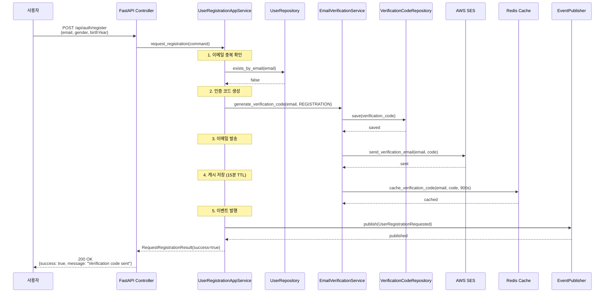
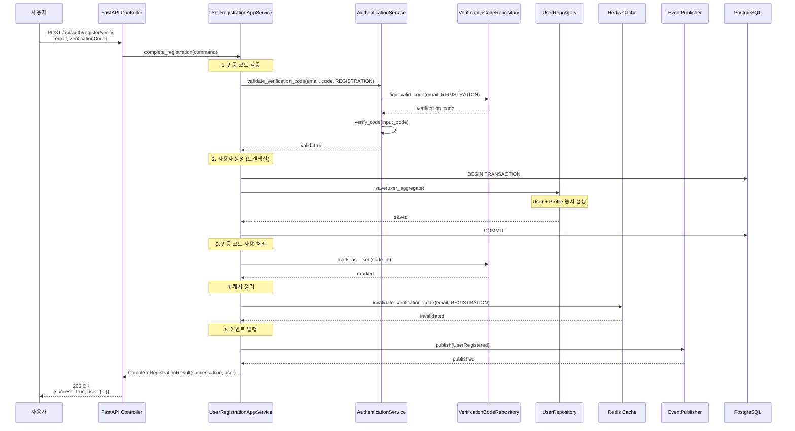
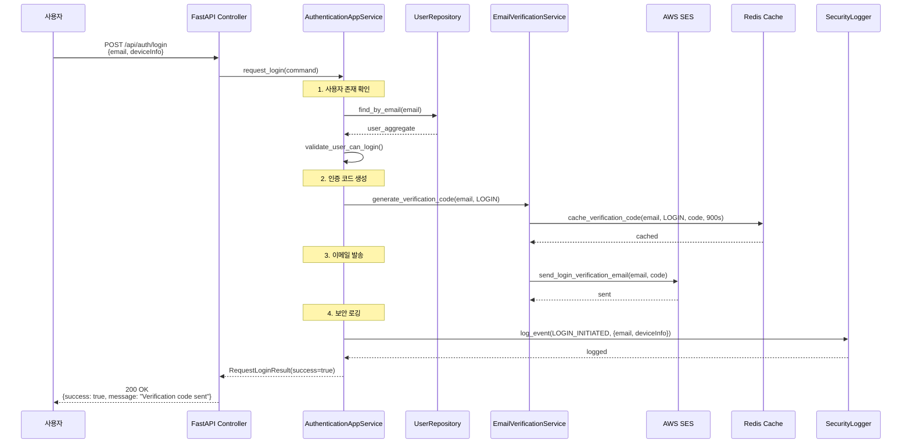
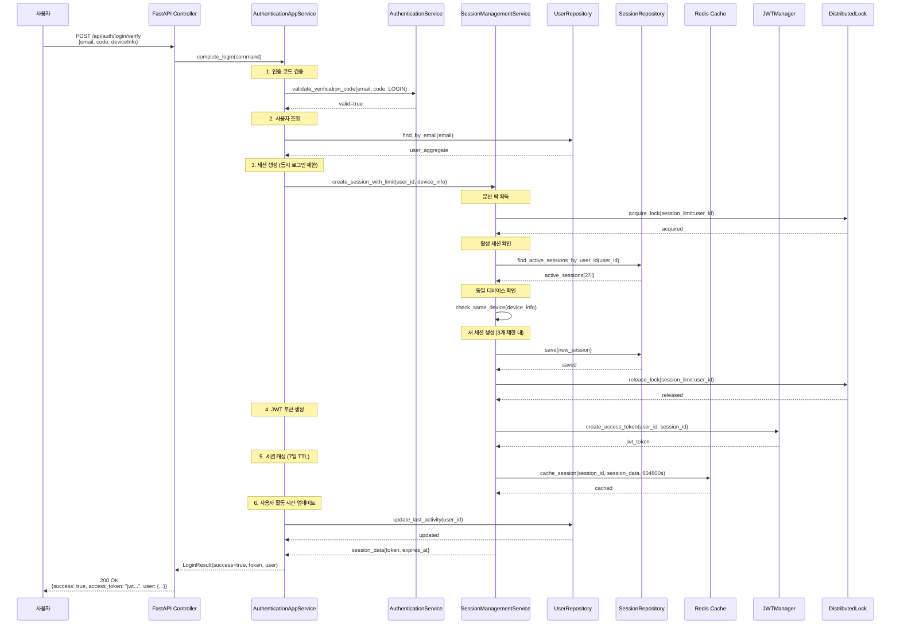
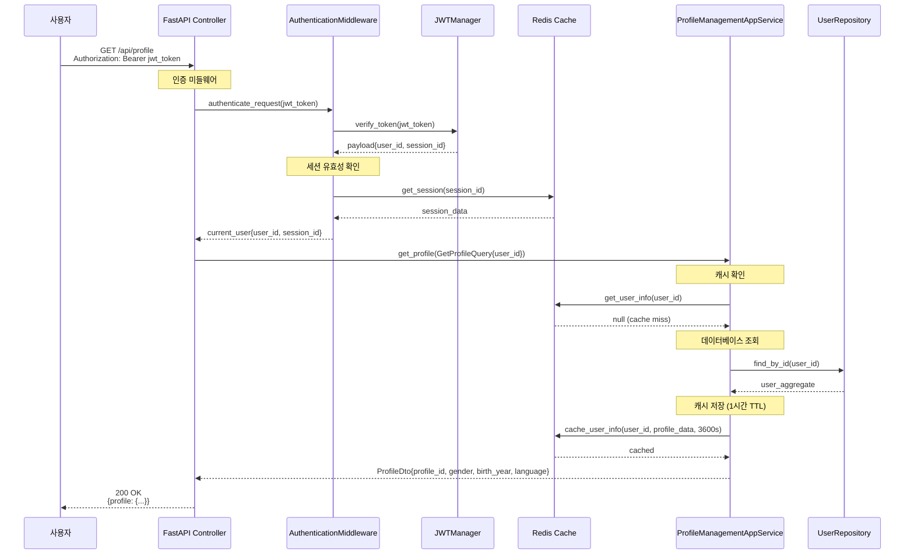
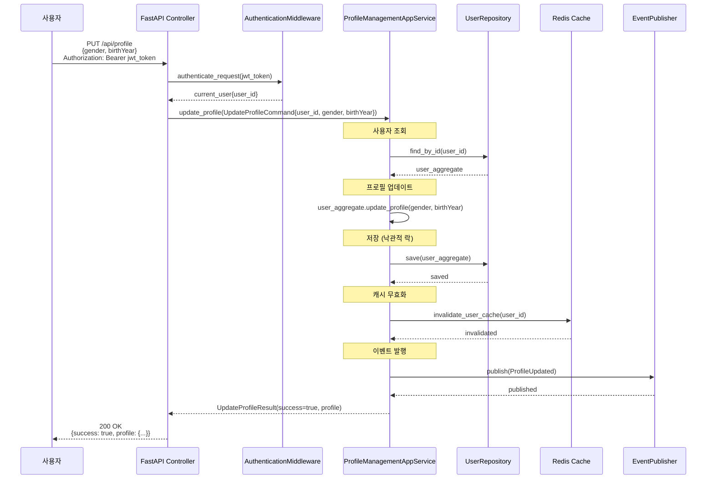
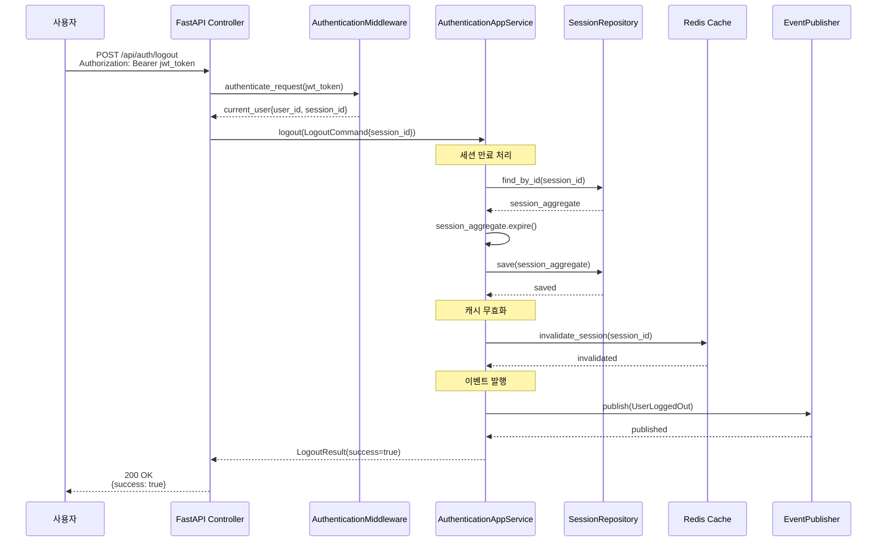
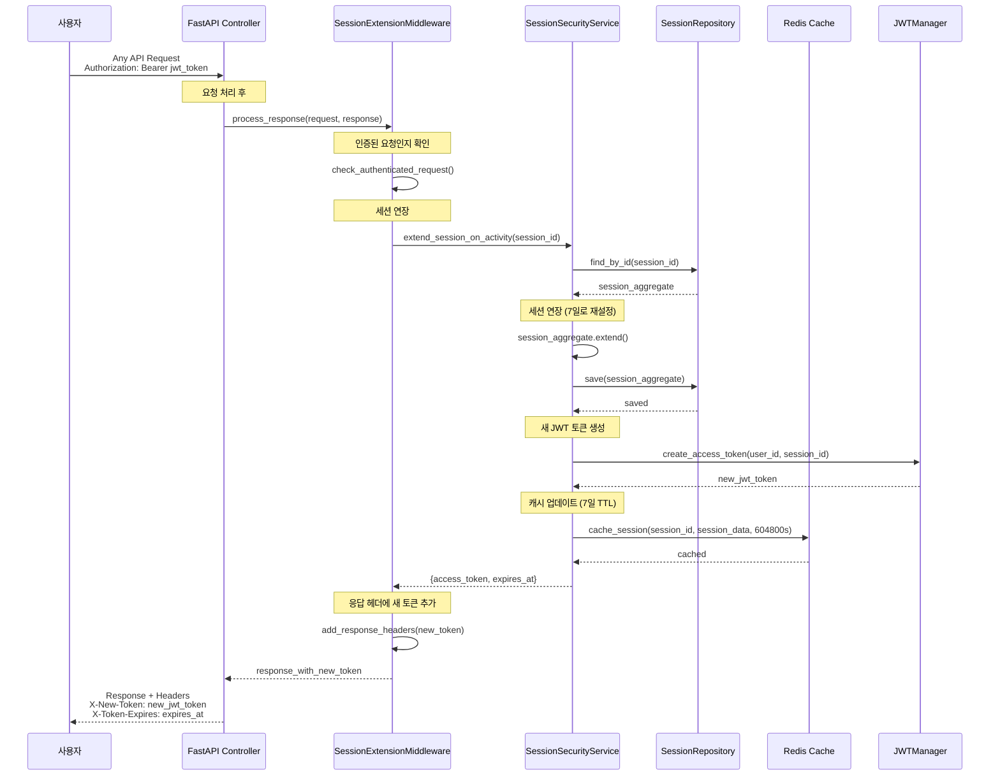

# Unit1 Authentication & Profile Management - API 시퀀스 다이어그램

## 1. 회원가입 요청 API (POST /api/auth/register)

## 2. 회원가입 완료 API (POST /api/auth/register/verify)

## 3. 로그인 요청 API (POST /api/auth/login)

## 4. 로그인 완료 API (POST /api/auth/login/verify)

## 5. 프로필 조회 API (GET /api/profile)

## 6. 프로필 수정 API (PUT /api/profile)

## 7. 로그아웃 API (POST /api/auth/logout)

## 8. 세션 자동 연장 (미들웨어)

이 시퀀스 다이어그램들은 Unit1의 핵심 API 플로우를 보여주며, 각 단계에서의 상호작용, 캐싱 전략, 보안 검증, 이벤트 발행 등을 상세히 나타냅니다.
