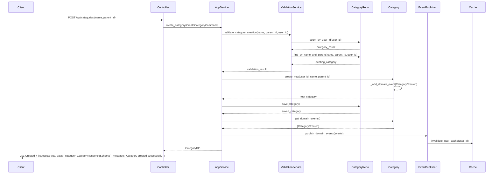
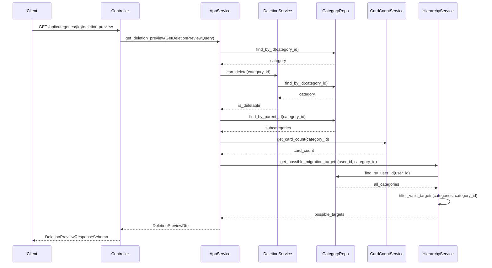
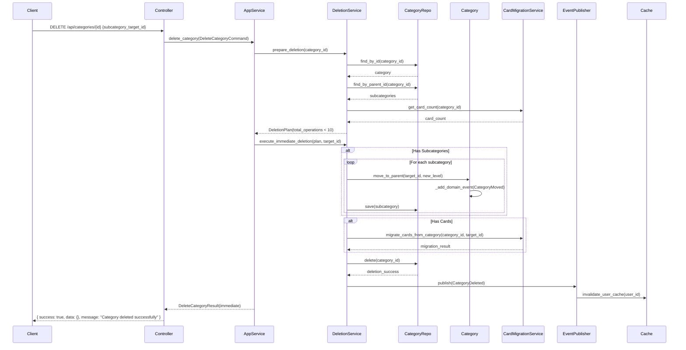
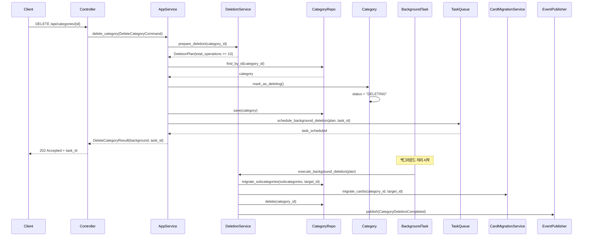
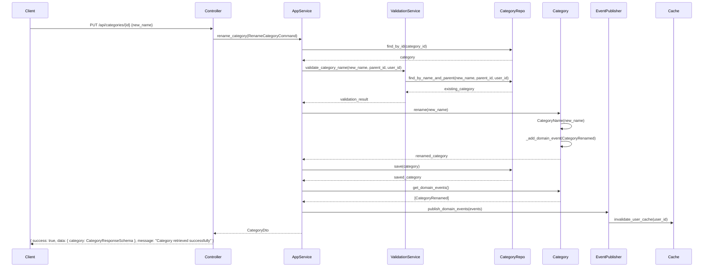
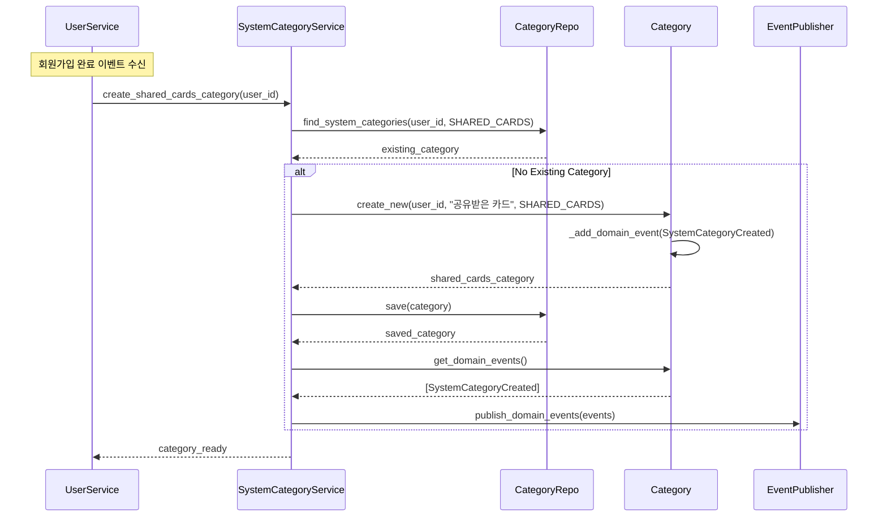
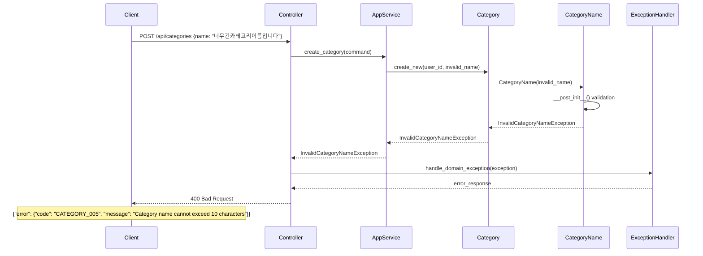
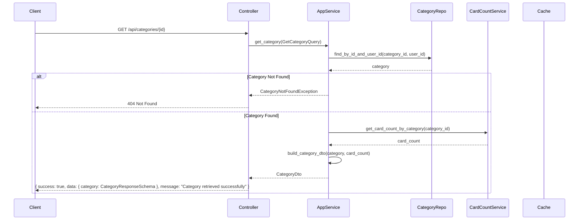
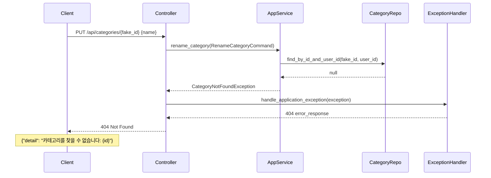

# Unit2: Category Management - Sequence Diagrams

## 1. 카테고리 생성 시퀀스 다이어그램

## 2. 카테고리 삭제 미리보기 시퀀스 다이어그램

## 3. 카테고리 삭제 (즉시 처리) 시퀀스 다이어그램

## 4. 카테고리 삭제 (백그라운드 처리) 시퀀스 다이어그램

## 5. 카테고리 이름 수정 시퀀스 다이어그램

## 6. 시스템 카테고리 자동 생성 시퀀스 다이어그램

## 7. 값 객체 검증 실패 시퀀스 다이어그램

## 9. 개별 카테고리 조회 시퀀스 다이어그램

## 10. CRUD 오류 처리 시퀀스 다이어그램

