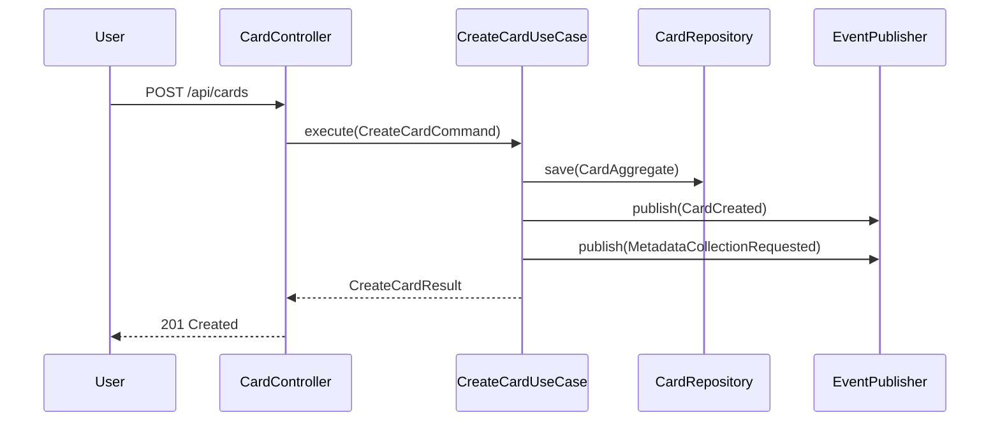

# Unit3: Card Creation & Management - 논리적 설계

## 개요
Unit3 Card Creation & Management의 소프트웨어 구현을 위한 논리적 설계입니다. 헥사고날 아키텍처를 기반으로 확장성이 높은 이벤트 기반 시스템을 설계합니다.

## 1. 아키텍처 레이어 설계

### 1.1 헥사고날 아키텍처 레이어 정의

```
┌─────────────────────────────────────────────────────────────┐
│                    Presentation Layer                       │
│  ┌─────────────────┐  ┌─────────────────┐  ┌──────────────┐ │
│  │  REST API       │  │   WebSocket     │  │   GraphQL    │ │
│  │  Controllers    │  │   Handlers      │  │   Resolvers  │ │
│  └─────────────────┘  └─────────────────┘  └──────────────┘ │
└─────────────────────────────────────────────────────────────┘
                                │
┌─────────────────────────────────────────────────────────────┐
│                   Application Layer                         │
│  ┌─────────────────┐  ┌─────────────────┐  ┌──────────────┐ │
│  │   Use Cases     │  │  Command/Query  │  │  Application │ │
│  │   Handlers      │  │    Objects      │  │   Services   │ │
│  └─────────────────┘  └─────────────────┘  └──────────────┘ │
└─────────────────────────────────────────────────────────────┘
                                │
┌─────────────────────────────────────────────────────────────┐
│                     Domain Layer                            │
│  ┌─────────────────┐  ┌─────────────────┐  ┌──────────────┐ │
│  │   Aggregates    │  │  Domain Events  │  │   Domain     │ │
│  │   Entities      │  │   Policies      │  │   Services   │ │
│  │  Value Objects  │  │                 │  │              │ │
│  └─────────────────┘  └─────────────────┘  └──────────────┘ │
└─────────────────────────────────────────────────────────────┘
                                │
┌─────────────────────────────────────────────────────────────┐
│                  Infrastructure Layer                       │
│  ┌─────────────────┐  ┌─────────────────┐  ┌──────────────┐ │
│  │  Repositories   │  │ External APIs   │  │   Message    │ │
│  │  (PostgreSQL)   │  │ (YouTube, AI)   │  │   Queues     │ │
│  │                 │  │                 │  │ (Redis/SQS)  │ │
│  └─────────────────┘  └─────────────────┘  └──────────────┘ │
└─────────────────────────────────────────────────────────────┘
```

#### Domain Layer (핵심 비즈니스 로직)
```python
# domain/
├── aggregates/
│   ├── card_aggregate.py          # Card 애그리게이트
│   └── __init__.py
├── entities/
│   ├── card.py                    # Card 엔티티
│   ├── video_metadata.py          # VideoMetadata 엔티티
│   └── __init__.py
├── value_objects/
│   ├── content_url.py             # ContentUrl (YouTube, Instagram 등)
│   ├── video_title.py             # VideoTitle
│   ├── thumbnail.py               # Thumbnail
│   ├── script.py                  # Script
│   ├── summary.py                 # Summary
│   ├── tags.py                    # Tags
│   ├── memo.py                    # Memo
│   ├── card_status.py             # CardStatus
│   └── __init__.py
├── events/
│   ├── card_created.py            # CardCreated 이벤트
│   ├── metadata_collected.py      # MetadataCollected 이벤트
│   ├── summary_generated.py       # SummaryGenerated 이벤트
│   └── __init__.py
├── services/
│   ├── card_duplication_checker.py
│   ├── content_metadata_extractor.py
│   └── __init__.py
├── policies/
│   ├── card_creation_policy.py
│   ├── metadata_collection_policy.py
│   └── __init__.py
└── repositories/
    ├── card_repository.py         # 인터페이스
    └── __init__.py
```

#### Application Layer (유스케이스 조정)
```python
# application/
├── use_cases/
│   ├── create_card_use_case.py
│   ├── get_card_use_case.py
│   ├── update_card_use_case.py
│   ├── delete_card_use_case.py
│   ├── get_cards_by_user_use_case.py
│   └── __init__.py
├── commands/
│   ├── create_card_command.py
│   ├── update_card_command.py
│   ├── delete_card_command.py
│   └── __init__.py
├── queries/
│   ├── get_card_query.py
│   ├── get_cards_by_user_query.py
│   └── __init__.py
├── handlers/
│   ├── command_handlers.py
│   ├── query_handlers.py
│   ├── event_handlers.py
│   └── __init__.py
├── services/
│   ├── card_application_service.py
│   └── __init__.py
└── dtos/
    ├── card_dto.py
    ├── create_card_dto.py
    └── __init__.py
```

#### Infrastructure Layer (외부 시스템 연동)
```python
# infrastructure/
├── repositories/
│   ├── postgresql_card_repository.py
│   └── __init__.py
├── external_services/
│   ├── youtube_api_adapter.py
│   ├── instagram_api_adapter.py
│   ├── web_scraper_adapter.py
│   ├── s3_thumbnail_storage_adapter.py
│   └── __init__.py
├── messaging/
│   ├── redis_event_publisher.py
│   ├── sqs_message_publisher.py
│   ├── event_handlers/
│   │   ├── metadata_collection_handler.py
│   │   └── __init__.py
│   └── __init__.py
├── persistence/
│   ├── postgresql_connection.py
│   ├── migrations/
│   └── __init__.py
└── config/
    ├── settings.py
    └── __init__.py
```

#### Presentation Layer (API 인터페이스)
```python
# presentation/
├── api/
│   ├── controllers/
│   │   ├── card_controller.py
│   │   └── __init__.py
│   ├── dtos/
│   │   ├── request_dtos.py
│   │   ├── response_dtos.py
│   │   └── __init__.py
│   ├── middleware/
│   │   ├── authentication_middleware.py
│   │   ├── error_handling_middleware.py
│   │   └── __init__.py
│   └── __init__.py
├── websocket/
│   ├── card_status_handler.py
│   └── __init__.py
└── __init__.py
```

### 1.2 의존성 방향 및 인터페이스 정의

```python
# 의존성 방향: Presentation → Application → Domain ← Infrastructure

# Domain Layer 인터페이스 (추상화)
from abc import ABC, abstractmethod
from typing import List, Optional
from uuid import UUID

class CardRepository(ABC):
    @abstractmethod
    async def save(self, card: CardAggregate) -> None: ...
    
    @abstractmethod
    async def find_by_id(self, card_id: UUID) -> Optional[CardAggregate]: ...
    
    @abstractmethod
    async def find_by_content_url(self, content_url: ContentUrl) -> Optional[CardAggregate]: ...

class ContentMetadataExtractor(ABC):
    @abstractmethod
    async def extract_metadata(self, content_url: ContentUrl) -> VideoMetadata: ...

class EventPublisher(ABC):
    @abstractmethod
    async def publish(self, event: DomainEvent) -> None: ...
```

### 1.3 패키지 구조 설계

```
src/
├── unit3_card_creation/
│   ├── domain/                    # 핵심 비즈니스 로직
│   ├── application/               # 유스케이스 조정
│   ├── infrastructure/            # 외부 시스템 연동
│   ├── presentation/              # API 인터페이스
│   └── __init__.py
├── shared/                        # 공통 모듈
│   ├── domain/
│   │   ├── base_aggregate.py
│   │   ├── base_entity.py
│   │   ├── base_value_object.py
│   │   └── domain_event.py
│   ├── infrastructure/
│   │   ├── database.py
│   │   ├── cache.py
│   │   └── messaging.py
│   └── __init__.py
├── tests/
│   ├── unit/
│   ├── integration/
│   └── e2e/
├── config/
│   ├── settings.py
│   ├── logging.py
│   └── __init__.py
└── main.py
```

## 의존성 주입 설계

```python
# infrastructure/di/container.py
from dependency_injector import containers, providers
from dependency_injector.wiring import Provide, inject

class Container(containers.DeclarativeContainer):
    # Configuration
    config = providers.Configuration()
    
    # Database
    database = providers.Singleton(
        PostgreSQLConnection,
        connection_string=config.database.connection_string
    )
    
    # Repositories
    card_repository = providers.Factory(
        PostgreSQLCardRepository,
        database=database
    )
    
    # External Services
    youtube_adapter = providers.Factory(
        YouTubeApiAdapter,
        api_key=config.youtube.api_key
    )
    
    # Use Cases
    create_card_use_case = providers.Factory(
        CreateCardUseCase,
        card_repository=card_repository,
        metadata_extractor=youtube_adapter
    )
    
    toggle_favorite_use_case = providers.Factory(
        ToggleFavoriteUseCase,
        card_repository=card_repository,
        event_publisher=event_publisher
    )
```

## 즐겨찾기 기능 추가

### ToggleFavoriteUseCase
```python
# application/use_cases/toggle_favorite_use_case.py
@dataclass
class ToggleFavoriteCommand:
    card_id: UUID
    user_id: UUID

@dataclass
class ToggleFavoriteResult:
    card_id: UUID
    is_favorite: bool
    message: str

class ToggleFavoriteUseCase:
    def __init__(
        self,
        card_repository: CardRepository,
        event_publisher: EventPublisher
    ):
        self._card_repository = card_repository
        self._event_publisher = event_publisher

    async def execute(self, command: ToggleFavoriteCommand) -> Optional[ToggleFavoriteResult]:
        # 1. 카드 조회 및 권한 확인
        card_aggregate = await self._card_repository.find_by_id(command.card_id)
        
        if not card_aggregate or card_aggregate.user_id != command.user_id:
            return None
        
        # 2. 즐겨찾기 토글
        card_aggregate.toggle_favorite()
        
        # 3. 저장 및 이벤트 발행
        await self._card_repository.save(card_aggregate)
        
        for event in card_aggregate.get_uncommitted_events():
            await self._event_publisher.publish(event)
        
        return ToggleFavoriteResult(
            card_id=card_aggregate.card_id,
            is_favorite=card_aggregate.is_favorite,
            message="즐겨찾기가 추가되었습니다." if card_aggregate.is_favorite else "즐겨찾기가 해제되었습니다."
        )
```

### GetCardsByUserQuery 업데이트
```python
@dataclass
class GetCardsByUserQuery:
    user_id: UUID
    category_id: Optional[UUID] = None
    favorites_only: bool = False  # 즐겨찾기 필터링
    limit: int = 20
    cursor: Optional[str] = None
```
    favorites_only: bool = False  # 즐겨찾기만 조회
    cursor: Optional[datetime] = None
    limit: int = 20
```

### Repository 인터페이스 추가
```python
class CardRepository(ABC):
    @abstractmethod
    async def find_favorites_by_user_with_cursor(
        self, 
        user_id: UUID, 
        cursor: Optional[datetime], 
        limit: int
    ) -> List[CardAggregate]: ...
```

### DTO 업데이트
```python
@dataclass
class CardSummaryDTO:
    card_id: str
    title: Optional[str]
    content_url: str
    thumbnail_url: Optional[str]
    status: str
    is_favorite: bool  # 추가
    favorited_at: Optional[str]  # 추가
    category: CategoryDTO
    created_at: str

@dataclass
class ToggleFavoriteResponseDTO:
    card_id: str
    is_favorite: bool
    message: str
```

## 3. Infrastructure Layer 설계

### 3.1 리포지토리 구현 설계

#### PostgreSQLCardRepository
```python
# infrastructure/repositories/postgresql_card_repository.py
import asyncpg
from typing import List, Optional
from uuid import UUID
from datetime import datetime

class PostgreSQLCardRepository(CardRepository):
    def __init__(self, connection_pool: asyncpg.Pool):
        self._pool = connection_pool

    async def save(self, card: CardAggregate) -> None:
        async with self._pool.acquire() as conn:
            async with conn.transaction():
                # 카드 기본 정보 저장/업데이트
                await conn.execute("""
                    INSERT INTO cards (
                        card_id, user_id, category_id, content_url, 
                        is_favorite, favorited_at, memo, tags, status, 
                        created_at, updated_at
                    ) VALUES ($1, $2, $3, $4, $5, $6, $7, $8, $9, $10, $11)
                    ON CONFLICT (card_id) DO UPDATE SET
                        category_id = EXCLUDED.category_id,
                        is_favorite = EXCLUDED.is_favorite,
                        favorited_at = EXCLUDED.favorited_at,
                        memo = EXCLUDED.memo,
                        tags = EXCLUDED.tags,
                        status = EXCLUDED.status,
                        updated_at = EXCLUDED.updated_at
                """, 
                    card.card_id, card.user_id, card.category_id,
                    card.content_url.value, card.is_favorite, card.favorited_at,
                    card.memo.content if card.memo else None,
                    card.tags.values if card.tags else [],
                    card.status.value, card.created_at, card.updated_at
                )
                
                # 비디오 메타데이터 저장 (별도 테이블)
                if card.video_metadata:
                    await conn.execute("""
                        INSERT INTO video_metadata (
                            card_id, title, thumbnail_url, script_content,
                            summary_content, duration, published_at
                        ) VALUES ($1, $2, $3, $4, $5, $6, $7)
                        ON CONFLICT (card_id) DO UPDATE SET
                            title = EXCLUDED.title,
                            thumbnail_url = EXCLUDED.thumbnail_url,
                            script_content = EXCLUDED.script_content,
                            summary_content = EXCLUDED.summary_content,
                            duration = EXCLUDED.duration,
                            published_at = EXCLUDED.published_at
                    """,
                        card.card_id,
                        card.video_metadata.title.value if card.video_metadata.title else None,
                        card.video_metadata.thumbnail.url if card.video_metadata.thumbnail else None,
                        card.video_metadata.script.content if card.video_metadata.script else None,
                        card.video_metadata.summary.content if card.video_metadata.summary else None,
                        card.video_metadata.duration,
                        card.video_metadata.published_at
                    )

    async def find_by_id(self, card_id: UUID) -> Optional[CardAggregate]:
        async with self._pool.acquire() as conn:
            # 카드와 메타데이터 조인 조회
            row = await conn.fetchrow("""
                SELECT 
                    c.card_id, c.user_id, c.category_id, c.content_url,
                    c.is_favorite, c.favorited_at, c.memo, c.tags, c.status,
                    c.created_at, c.updated_at,
                    vm.title, vm.thumbnail_url, vm.script_content,
                    vm.summary_content, vm.duration, vm.published_at
                FROM cards c
                LEFT JOIN video_metadata vm ON c.card_id = vm.card_id
                WHERE c.card_id = $1 AND c.deleted_at IS NULL
            """, card_id)
            
            if not row:
                return None
            
            return self._map_to_aggregate(row)

    async def find_by_user_with_cursor(
        self, 
        user_id: UUID, 
        category_id: Optional[UUID] = None,
        cursor: Optional[datetime] = None, 
        limit: int = 20
    ) -> List[CardAggregate]:
        async with self._pool.acquire() as conn:
            query = """
                SELECT 
                    c.card_id, c.user_id, c.category_id, c.content_url,
                    c.is_favorite, c.favorited_at, c.memo, c.tags, c.status,
                    c.created_at, c.updated_at,
                    vm.title, vm.thumbnail_url, vm.script_content,
                    vm.summary_content, vm.duration, vm.published_at
                FROM cards c
                LEFT JOIN video_metadata vm ON c.card_id = vm.card_id
                WHERE c.user_id = $1 AND c.deleted_at IS NULL
            """
            params = [user_id]
            
            # 카테고리 필터
            if category_id:
                query += " AND c.category_id = $2"
                params.append(category_id)
                param_idx = 3
            else:
                param_idx = 2
            
            # 커서 조건
            if cursor:
                query += f" AND c.created_at < ${param_idx}"
                params.append(cursor)
            
            query += " ORDER BY c.created_at DESC LIMIT $" + str(len(params) + 1)
            params.append(limit)
            
            rows = await conn.fetch(query, *params)
            return [self._map_to_aggregate(row) for row in rows]

    async def find_favorites_by_user_with_cursor(
        self, 
        user_id: UUID, 
        cursor: Optional[datetime] = None, 
        limit: int = 20
    ) -> List[CardAggregate]:
        async with self._pool.acquire() as conn:
            query = """
                SELECT 
                    c.card_id, c.user_id, c.category_id, c.content_url,
                    c.is_favorite, c.favorited_at, c.memo, c.tags, c.status,
                    c.created_at, c.updated_at,
                    vm.title, vm.thumbnail_url, vm.script_content,
                    vm.summary_content, vm.duration, vm.published_at
                FROM cards c
                LEFT JOIN video_metadata vm ON c.card_id = vm.card_id
                WHERE c.user_id = $1 AND c.is_favorite = true AND c.deleted_at IS NULL
            """
            params = [user_id]
            
            if cursor:
                query += " AND c.favorited_at < $2"
                params.append(cursor)
            
            query += " ORDER BY c.favorited_at DESC LIMIT $" + str(len(params) + 1)
            params.append(limit)
            
            rows = await conn.fetch(query, *params)
            return [self._map_to_aggregate(row) for row in rows]

    def _map_to_aggregate(self, row) -> CardAggregate:
        # 데이터베이스 레코드를 도메인 애그리게이트로 매핑
        video_metadata = None
        if row['title'] or row['thumbnail_url'] or row['script_content']:
            video_metadata = VideoMetadata(
                title=VideoTitle(row['title']) if row['title'] else None,
                thumbnail=Thumbnail(row['thumbnail_url']) if row['thumbnail_url'] else None,
                script=Script(row['script_content']) if row['script_content'] else None,
                summary=Summary(row['summary_content']) if row['summary_content'] else None,
                duration=row['duration'],
                published_at=row['published_at']
            )
        
        return CardAggregate.reconstruct(
            card_id=row['card_id'],
            user_id=row['user_id'],
            category_id=row['category_id'],
            content_url=ContentUrl(row['content_url']),
            video_metadata=video_metadata,
            memo=Memo(row['memo']) if row['memo'] else None,
            tags=Tags(row['tags']) if row['tags'] else None,
            status=CardStatus(row['status']),
            is_favorite=row['is_favorite'],
            favorited_at=row['favorited_at'],
            created_at=row['created_at'],
            updated_at=row['updated_at']
        )
```

### 3.2 외부 서비스 어댑터 설계

#### YouTubeApiAdapter
```python
# infrastructure/external_services/youtube_api_adapter.py
import aiohttp
from typing import Optional
from youtube_transcript_api import YouTubeTranscriptApi

class YouTubeApiAdapter(ContentMetadataExtractor):
    def __init__(self, api_key: str):
        self._api_key = api_key
        self._base_url = "https://www.googleapis.com/youtube/v3"

    async def extract_metadata(self, content_url: ContentUrl) -> VideoMetadata:
        video_id = self._extract_video_id(content_url.value)
        
        # YouTube API로 기본 정보 수집
        async with aiohttp.ClientSession() as session:
            # 비디오 정보 조회
            video_info = await self._get_video_info(session, video_id)
            
            # 스크립트 수집 (별도 라이브러리 사용)
            script_content = await self._get_video_transcript(video_id)
            
            return VideoMetadata(
                title=VideoTitle(video_info['title']),
                thumbnail=Thumbnail(video_info['thumbnail_url']),
                script=Script(script_content) if script_content else None,
                duration=video_info['duration'],
                published_at=video_info['published_at']
            )

    async def _get_video_info(self, session: aiohttp.ClientSession, video_id: str) -> dict:
        url = f"{self._base_url}/videos"
        params = {
            'part': 'snippet,contentDetails',
            'id': video_id,
            'key': self._api_key
        }
        
        async with session.get(url, params=params) as response:
            if response.status != 200:
                raise YouTubeApiException(f"YouTube API error: {response.status}")
            
            data = await response.json()
            if not data['items']:
                raise VideoNotFoundException(f"Video not found: {video_id}")
            
            item = data['items'][0]
            snippet = item['snippet']
            
            return {
                'title': snippet['title'],
                'thumbnail_url': snippet['thumbnails']['high']['url'],
                'duration': self._parse_duration(item['contentDetails']['duration']),
                'published_at': snippet['publishedAt']
            }

    async def _get_video_transcript(self, video_id: str) -> Optional[str]:
        try:
            # 한국어 자막 우선, 없으면 영어, 없으면 자동 생성
            transcript_list = YouTubeTranscriptApi.list_transcripts(video_id)
            
            # 한국어 자막 시도
            try:
                transcript = transcript_list.find_transcript(['ko'])
                return self._format_transcript(transcript.fetch())
            except:
                pass
            
            # 영어 자막 시도
            try:
                transcript = transcript_list.find_transcript(['en'])
                return self._format_transcript(transcript.fetch())
            except:
                pass
            
            # 자동 생성 자막 시도
            try:
                transcript = transcript_list.find_generated_transcript(['ko', 'en'])
                return self._format_transcript(transcript.fetch())
            except:
                return None
                
        except Exception:
            return None

    def _format_transcript(self, transcript_data: list) -> str:
        return ' '.join([item['text'] for item in transcript_data])
```

#### BedrockAiSummaryAdapter
```python
# infrastructure/external_services/bedrock_ai_summary_adapter.py
import boto3
import json
from typing import Optional

class BedrockAiSummaryAdapter(AiSummaryGenerator):
    def __init__(self, region: str = 'us-east-1'):
        self._client = boto3.client('bedrock-runtime', region_name=region)
        self._model_id = 'anthropic.claude-3-sonnet-20240229-v1:0'

    async def generate_summary(self, script: Script) -> Summary:
        if len(script.content) > 100000:  # 100,000자 제한
            raise ScriptTooLongException("스크립트가 너무 길어 요약할 수 없습니다.")
        
        prompt = self._build_prompt(script.content)
        
        try:
            response = self._client.invoke_model(
                modelId=self._model_id,
                body=json.dumps({
                    "anthropic_version": "bedrock-2023-05-31",
                    "max_tokens": 200,  # 3-5줄 제한
                    "messages": [
                        {
                            "role": "user",
                            "content": prompt
                        }
                    ]
                })
            )
            
            result = json.loads(response['body'].read())
            summary_text = result['content'][0]['text'].strip()
            
            return Summary(summary_text)
            
        except Exception as e:
            raise AiSummaryGenerationException(f"AI 요약 생성 실패: {str(e)}")

    def _build_prompt(self, script_content: str) -> str:
        return f"""
다음 동영상 스크립트를 3-5줄로 요약해주세요. 핵심 내용만 간결하게 정리해주세요.

스크립트:
{script_content}

요약:
"""
```

### 3.3 이벤트 발행 인프라 설계

#### Redis Event Publisher (메타데이터 수집용)
```python
# infrastructure/messaging/redis_event_publisher.py
import redis.asyncio as redis
import json
from typing import Any

class RedisEventPublisher(EventPublisher):
    def __init__(self, redis_url: str):
        self._redis = redis.from_url(redis_url)

    async def publish(self, event: DomainEvent) -> None:
        channel = f"events.{event.__class__.__name__}"
        message = {
            'event_type': event.__class__.__name__,
            'event_data': event.to_dict(),
            'timestamp': event.occurred_at.isoformat()
        }
        
        await self._redis.publish(channel, json.dumps(message))

# 메타데이터 수집 이벤트 핸들러
class MetadataCollectionHandler:
    def __init__(
        self, 
        youtube_adapter: YouTubeApiAdapter,
        card_repository: CardRepository
    ):
        self._youtube_adapter = youtube_adapter
        self._card_repository = card_repository

    async def handle_metadata_collection_requested(self, event_data: dict):
        card_id = UUID(event_data['card_id'])
        content_url = ContentUrl(event_data['content_url'])
        
        try:
            # 메타데이터 수집
            metadata = await self._youtube_adapter.extract_metadata(content_url)
            
            # 카드 업데이트
            card = await self._card_repository.find_by_id(card_id)
            if card:
                card.update_metadata(metadata)
                await self._card_repository.save(card)
                
        except Exception as e:
            # 실패 처리
            card = await self._card_repository.find_by_id(card_id)
            if card:
                card.mark_metadata_collection_failed(str(e))
                await self._card_repository.save(card)
```

#### SQS Message Publisher (AI 요약용)
```python
# infrastructure/messaging/sqs_message_publisher.py
import boto3
import json

class SqsMessagePublisher:
    def __init__(self, queue_url: str, region: str = 'us-east-1'):
        self._sqs = boto3.client('sqs', region_name=region)
        self._queue_url = queue_url

    async def publish_summary_generation_request(self, card_id: UUID, script: Script):
        message = {
            'card_id': str(card_id),
            'script_content': script.content,
            'timestamp': datetime.utcnow().isoformat()
        }
        
        self._sqs.send_message(
            QueueUrl=self._queue_url,
            MessageBody=json.dumps(message),
            DelaySeconds=0
        )
```

### 3.4 설정 관리 및 환경 변수 설계

```python
# infrastructure/config/settings.py
from pydantic import BaseSettings
from typing import Optional

class Settings(BaseSettings):
    # Database
    database_url: str
    database_pool_size: int = 10
    
    # YouTube API
    youtube_api_key: str
    
    # AWS
    aws_region: str = 'us-east-1'
    aws_access_key_id: Optional[str] = None
    aws_secret_access_key: Optional[str] = None
    
    # Redis
    redis_url: str = 'redis://localhost:6379'
    
    # SQS
    sqs_summary_queue_url: str
    
    # S3
    s3_bucket_name: str
    s3_thumbnail_prefix: str = 'thumbnails/'
    
    # Thumbnail Strategy
    thumbnail_source: str = 'S3'  # S3 or YOUTUBE
    
    # Logging
    log_retention_days: int = 90
    log_level: str = 'INFO'
    
    class Config:
        env_file = '.env'

settings = Settings()
```

## 4. Presentation Layer 설계

### 4.1 REST API 컨트롤러 설계

#### CardController
```python
# presentation/api/controllers/card_controller.py
from fastapi import APIRouter, Depends, HTTPException, Query
from fastapi.security import HTTPBearer
from typing import Optional, List
from uuid import UUID

router = APIRouter(prefix="/api/cards", tags=["cards"])
security = HTTPBearer()

class CardController:
    def __init__(self, card_service: CardApplicationService):
        self._card_service = card_service

@router.post("/", response_model=CreateCardResponseDTO)
async def create_card(
    request: CreateCardRequestDTO,
    current_user: dict = Depends(get_current_user),
    controller: CardController = Depends()
):
    """새 카드 생성"""
    command = CreateCardCommand(
        user_id=UUID(current_user["user_id"]),
        category_id=UUID(request.category_id),
        content_url=request.content_url,
        memo=request.memo
    )
    
    result = await controller._card_service.create_card(command)
    
    return CreateCardResponseDTO(
        card_id=str(result.card_id),
        status=result.status,
        message=result.message
    )

@router.get("/{card_id}", response_model=CardDetailResponseDTO)
async def get_card(
    card_id: str,
    current_user: dict = Depends(get_current_user),
    controller: CardController = Depends()
):
    """카드 상세 조회"""
    query = GetCardQuery(
        card_id=UUID(card_id),
        user_id=UUID(current_user["user_id"])
    )
    
    result = await controller._card_service.get_card(query)
    
    if not result:
        raise HTTPException(status_code=404, detail="카드를 찾을 수 없습니다.")
    
    return CardDetailResponseDTO(
        card_id=str(result.card_id),
        title=result.title,
        content_url=result.content_url,
        thumbnail_url=result.thumbnail_url,
        status=result.status,
        tags=result.tags,
        memo=result.memo,
        status=result.status,
        is_favorite=result.is_favorite,
        favorited_at=result.favorited_at.isoformat() if result.favorited_at else None,
        category=CategoryDTO(
            id=str(result.category_id),
            name=result.category_name
        ),
        created_at=result.created_at.isoformat(),
        updated_at=result.updated_at.isoformat()
    )

@router.get("/", response_model=CardListResponseDTO)
async def get_cards(
    category_id: Optional[str] = Query(None),
    favorites_only: bool = Query(False),
    cursor: Optional[str] = Query(None),
    limit: int = Query(20, ge=1, le=100),
    current_user: dict = Depends(get_current_user),
    controller: CardController = Depends()
):
    """카드 목록 조회 (커서 기반 페이지네이션)"""
    query = GetCardsByUserQuery(
        user_id=UUID(current_user["user_id"]),
        category_id=UUID(category_id) if category_id else None,
        favorites_only=favorites_only,
        cursor=datetime.fromisoformat(cursor) if cursor else None,
        limit=limit
    )
    
    result = await controller._card_service.get_cards_by_user(query)
    
    return CardListResponseDTO(
        cards=[
            CardSummaryDTO(
                card_id=str(card.card_id),
                title=card.title,
                content_url=card.content_url,
                thumbnail_url=card.thumbnail_url,
                status=card.status,
                is_favorite=card.is_favorite,
                favorited_at=card.favorited_at.isoformat() if card.favorited_at else None,
                category=CategoryDTO(
                    id=str(card.category_id),
                    name=card.category_name
                ),
                created_at=card.created_at.isoformat()
            ) for card in result.cards
        ],
        next_cursor=result.next_cursor.isoformat() if result.next_cursor else None,
        has_more=result.has_more
    )

@router.put("/{card_id}", response_model=dict)
async def update_card(
    card_id: str,
    request: UpdateCardRequestDTO,
    current_user: dict = Depends(get_current_user),
    controller: CardController = Depends()
):
    """카드 정보 수정"""
    command = UpdateCardCommand(
        card_id=UUID(card_id),
        user_id=UUID(current_user["user_id"]),
        category_id=UUID(request.category_id) if request.category_id else None,
        memo=request.memo,
        tags=request.tags
    )
    
    success = await controller._card_service.update_card(command)
    
    if not success:
        raise HTTPException(status_code=404, detail="카드를 찾을 수 없습니다.")
    
    return {"success": True, "message": "카드가 수정되었습니다."}

@router.post("/{card_id}/favorite", response_model=ToggleFavoriteResponseDTO)
async def toggle_favorite(
    card_id: str,
    current_user: dict = Depends(get_current_user),
    controller: CardController = Depends()
):
    """즐겨찾기 토글"""
    command = ToggleFavoriteCommand(
        card_id=UUID(card_id),
        user_id=UUID(current_user["user_id"])
    )
    
    result = await controller._card_service.toggle_favorite(command)
    
    if not result:
        raise HTTPException(status_code=404, detail="카드를 찾을 수 없습니다.")
    
    return ToggleFavoriteResponseDTO(
        card_id=str(result.card_id),
        is_favorite=result.is_favorite,
        message=result.message
    )

@router.delete("/{card_id}", response_model=dict)
async def delete_card(
    card_id: str,
    current_user: dict = Depends(get_current_user),
    controller: CardController = Depends()
):
    """카드 삭제"""
    command = DeleteCardCommand(
        card_id=UUID(card_id),
        user_id=UUID(current_user["user_id"])
    )
    
    success = await controller._card_service.delete_card(command)
    
    if not success:
        raise HTTPException(status_code=404, detail="카드를 찾을 수 없습니다.")
    
    return {"success": True, "message": "카드가 삭제되었습니다."}
```

### 4.2 API 문서화 (OpenAPI/Swagger)

```python
# presentation/api/docs/openapi_config.py
from fastapi import FastAPI

def setup_openapi(app: FastAPI):
    app.openapi_tags = [
        {
            "name": "cards",
            "description": "카드 생성 및 관리 API",
        }
    ]
    
    app.openapi_info = {
        "title": "Unit3 Card Creation API",
        "description": """
        유튜브 링크 기반 카드 생성 및 관리 API
        
        ## 주요 기능
        - 유튜브 링크로 카드 생성
        - 즐겨찾기 관리
        - 커서 기반 페이지네이션
        - 카테고리별 필터링
        
        ## 인증
        Bearer 토큰 기반 인증 (Unit1 연동)
        """,
        "version": "1.0.0"
    }

# API 스키마 예시
card_creation_examples = {
    "youtube_video": {
        "summary": "유튜브 동영상 카드 생성",
        "value": {
            "content_url": "https://www.youtube.com/watch?v=dQw4w9WgXcQ",
            "category_id": "550e8400-e29b-41d4-a716-446655440000",
            "memo": "재미있는 뮤직비디오"
        }
    },
    "instagram_reel": {
        "summary": "인스타그램 릴스 카드 생성",
        "value": {
            "content_url": "https://www.instagram.com/reel/ABC123/",
            "category_id": "550e8400-e29b-41d4-a716-446655440001",
            "memo": "인스타그램 릴스 콘텐츠"
        }
    }
}
```

### 4.3 인증/인가 미들웨어 통합

```python
# presentation/api/middleware/authentication_middleware.py
from fastapi import HTTPException, Depends
from fastapi.security import HTTPBearer
import jwt
from typing import Dict

security = HTTPBearer()

async def get_current_user(token: str = Depends(security)) -> Dict:
    """Unit1 인증 토큰 검증"""
    try:
        # JWT 토큰 검증 (Unit1과 동일한 시크릿 키 사용)
        payload = jwt.decode(
            token.credentials, 
            settings.jwt_secret_key, 
            algorithms=["HS256"]
        )
        
        user_id = payload.get("user_id")
        if not user_id:
            raise HTTPException(status_code=401, detail="Invalid token")
        
        return {
            "user_id": user_id,
            "email": payload.get("email"),
            "session_id": payload.get("session_id")
        }
        
    except jwt.ExpiredSignatureError:
        raise HTTPException(status_code=401, detail="Token expired")
    except jwt.JWTError:
        raise HTTPException(status_code=401, detail="Invalid token")

# 권한 확인 데코레이터
def require_card_owner(func):
    """카드 소유자만 접근 가능"""
    async def wrapper(*args, **kwargs):
        card_id = kwargs.get('card_id')
        current_user = kwargs.get('current_user')
        
        # 카드 소유자 확인 로직
        # ... 구현
        
        return await func(*args, **kwargs)
    return wrapper
```

### 4.4 오류 처리 및 응답 표준화

```python
# presentation/api/middleware/error_handling_middleware.py
from fastapi import Request, HTTPException
from fastapi.responses import JSONResponse
from fastapi.exceptions import RequestValidationError
import logging

logger = logging.getLogger(__name__)

async def global_exception_handler(request: Request, exc: Exception):
    """전역 예외 처리"""
    
    # 도메인 예외 처리
    if isinstance(exc, DomainException):
        return JSONResponse(
            status_code=400,
            content={
                "error": {
                    "code": exc.error_code,
                    "message": exc.message,
                    "type": "domain_error"
                }
            }
        )
    
    # 외부 서비스 예외 처리
    elif isinstance(exc, YouTubeApiException):
        return JSONResponse(
            status_code=502,
            content={
                "error": {
                    "code": "YOUTUBE_API_ERROR",
                    "message": "YouTube 서비스에 일시적인 문제가 있습니다. 잠시 후 다시 시도해주세요.",
                    "type": "external_service_error"
                }
            }
        )
    
    elif isinstance(exc, AiSummaryGenerationException):
        return JSONResponse(
            status_code=502,
            content={
                "error": {
                    "code": "AI_SUMMARY_ERROR",
                    "message": "AI 요약 생성에 실패했습니다. 잠시 후 다시 시도해주세요.",
                    "type": "external_service_error"
                }
            }
        )
    
    # HTTP 예외 처리
    elif isinstance(exc, HTTPException):
        return JSONResponse(
            status_code=exc.status_code,
            content={
                "error": {
                    "code": f"HTTP_{exc.status_code}",
                    "message": exc.detail,
                    "type": "http_error"
                }
            }
        )
    
    # 검증 오류 처리
    elif isinstance(exc, RequestValidationError):
        return JSONResponse(
            status_code=422,
            content={
                "error": {
                    "code": "VALIDATION_ERROR",
                    "message": "입력 데이터가 올바르지 않습니다.",
                    "details": exc.errors(),
                    "type": "validation_error"
                }
            }
        )
    
    # 예상치 못한 오류
    else:
        logger.error(f"Unexpected error: {exc}", exc_info=True)
        return JSONResponse(
            status_code=500,
            content={
                "error": {
                    "code": "INTERNAL_SERVER_ERROR",
                    "message": "서버 내부 오류가 발생했습니다.",
                    "type": "server_error"
                }
            }
        )

# 표준 응답 형식
class StandardResponse:
    @staticmethod
    def success(data=None, message="Success"):
        return {
            "success": True,
            "message": message,
            "data": data
        }
    
    @staticmethod
    def error(code: str, message: str, details=None):
        return {
            "success": False,
            "error": {
                "code": code,
                "message": message,
                "details": details
            }
        }
```

### 4.5 CORS 및 보안 헤더 설정

```python
# presentation/api/middleware/security_middleware.py
from fastapi.middleware.cors import CORSMiddleware
from fastapi.middleware.trustedhost import TrustedHostMiddleware
from fastapi import FastAPI

def setup_security_middleware(app: FastAPI):
    # CORS 설정
    app.add_middleware(
        CORSMiddleware,
        allow_origins=settings.allowed_origins,
        allow_credentials=True,
        allow_methods=["GET", "POST", "PUT", "DELETE"],
        allow_headers=["*"],
    )
    
    # 신뢰할 수 있는 호스트만 허용
    app.add_middleware(
        TrustedHostMiddleware,
        allowed_hosts=settings.allowed_hosts
    )

# 보안 헤더 미들웨어
async def security_headers_middleware(request: Request, call_next):
    response = await call_next(request)
    
    # 보안 헤더 추가
    response.headers["X-Content-Type-Options"] = "nosniff"
    response.headers["X-Frame-Options"] = "DENY"
    response.headers["X-XSS-Protection"] = "1; mode=block"
    response.headers["Strict-Transport-Security"] = "max-age=31536000; includeSubDomains"
    
    return response
```

## 5. 이벤트 기반 아키텍처 설계

### 5.1 도메인 이벤트 발행 메커니즘

```python
# domain/events/base_domain_event.py
from abc import ABC
from datetime import datetime
from uuid import UUID, uuid4
from typing import Dict, Any

class DomainEvent(ABC):
    def __init__(self, aggregate_id: UUID):
        self.event_id = uuid4()
        self.aggregate_id = aggregate_id
        self.occurred_at = datetime.utcnow()
    
    def to_dict(self) -> Dict[str, Any]:
        return {
            'event_id': str(self.event_id),
            'aggregate_id': str(self.aggregate_id),
            'occurred_at': self.occurred_at.isoformat(),
            **self._get_event_data()
        }
    
    def _get_event_data(self) -> Dict[str, Any]:
        """서브클래스에서 구현"""
        return {}

# 카드 관련 도메인 이벤트들
class CardCreated(DomainEvent):
    def __init__(self, card_id: UUID, user_id: UUID, content_url: str, category_id: UUID):
        super().__init__(card_id)
        self.card_id = card_id
        self.user_id = user_id
        self.content_url = content_url
        self.category_id = category_id
    
    def _get_event_data(self) -> Dict[str, Any]:
        return {
            'card_id': str(self.card_id),
            'user_id': str(self.user_id),
            'content_url': self.content_url,
            'category_id': str(self.category_id)
        }

class MetadataCollectionRequested(DomainEvent):
    def __init__(self, card_id: UUID, content_url: str, user_id: UUID):
        super().__init__(card_id)
        self.card_id = card_id
        self.content_url = content_url
        self.user_id = user_id
    
    def _get_event_data(self) -> Dict[str, Any]:
        return {
            'card_id': str(self.card_id),
            'content_url': self.content_url,
            'user_id': str(self.user_id)
        }

class MetadataCollected(DomainEvent):
    def __init__(self, card_id: UUID, title: str, thumbnail_url: str, script_length: int):
        super().__init__(card_id)
        self.card_id = card_id
        self.title = title
        self.thumbnail_url = thumbnail_url
        self.script_length = script_length
    
    def _get_event_data(self) -> Dict[str, Any]:
        return {
            'card_id': str(self.card_id),
            'title': self.title,
            'thumbnail_url': self.thumbnail_url,
            'script_length': self.script_length
        }

class SummaryGenerationRequested(DomainEvent):
    def __init__(self, card_id: UUID, script_content: str):
        super().__init__(card_id)
        self.card_id = card_id
        self.script_content = script_content
    
    def _get_event_data(self) -> Dict[str, Any]:
        return {
            'card_id': str(self.card_id),
            'script_length': len(self.script_content)
        }

class SummaryGenerated(DomainEvent):
    def __init__(self, card_id: UUID, summary_content: str):
        super().__init__(card_id)
        self.card_id = card_id
        self.summary_content = summary_content
    
    def _get_event_data(self) -> Dict[str, Any]:
        return {
            'card_id': str(self.card_id),
            'summary_length': len(self.summary_content)
        }

class CardFavoriteToggled(DomainEvent):
    def __init__(self, card_id: UUID, user_id: UUID, is_favorite: bool):
        super().__init__(card_id)
        self.card_id = card_id
        self.user_id = user_id
        self.is_favorite = is_favorite
    
    def _get_event_data(self) -> Dict[str, Any]:
        return {
            'card_id': str(self.card_id),
            'user_id': str(self.user_id),
            'is_favorite': self.is_favorite
        }
```

### 5.2 이벤트 핸들러 설계

#### MetadataCollectionEventHandler (Redis 기반)
```python
# infrastructure/messaging/event_handlers/metadata_collection_handler.py
import redis.asyncio as redis
import json
import asyncio
from typing import Dict

class MetadataCollectionEventHandler:
    def __init__(
        self,
        redis_client: redis.Redis,
        youtube_adapter: YouTubeApiAdapter,
        instagram_adapter: InstagramApiAdapter,
        web_scraper_adapter: WebScraperAdapter,
        card_repository: CardRepository,
        event_publisher: EventPublisher
    ):
        self._redis = redis_client
        self._youtube_adapter = youtube_adapter
        self._instagram_adapter = instagram_adapter
        self._web_scraper_adapter = web_scraper_adapter
        self._card_repository = card_repository
        self._event_publisher = event_publisher

    async def start_listening(self):
        """Redis Pub/Sub 리스너 시작"""
        pubsub = self._redis.pubsub()
        await pubsub.subscribe("events.MetadataCollectionRequested")
        
        async for message in pubsub.listen():
            if message['type'] == 'message':
                try:
                    event_data = json.loads(message['data'])
                    await self._handle_metadata_collection_requested(event_data)
                except Exception as e:
                    logger.error(f"메타데이터 수집 처리 실패: {e}")

    async def _handle_metadata_collection_requested(self, event_data: Dict):
        card_id = UUID(event_data['card_id'])
        content_url = event_data['content_url']
        user_id = UUID(event_data['user_id'])
        
        try:
            # URL 타입에 따른 어댑터 선택
            adapter = self._select_adapter(content_url)
            
            # 메타데이터 수집 (재시도 로직 포함)
            metadata = await self._collect_metadata_with_retry(adapter, content_url)
            
            # 카드 업데이트
            card = await self._card_repository.find_by_id(card_id)
            if card:
                card.update_metadata(metadata)
                await self._card_repository.save(card)
                
                # 메타데이터 수집 완료 이벤트 발행
                await self._event_publisher.publish(
                    MetadataCollected(
                        card_id=card_id,
                        title=metadata.title.value if metadata.title else "",
                        thumbnail_url=metadata.thumbnail.url if metadata.thumbnail else "",
                        script_length=len(metadata.script.content) if metadata.script else 0
                    )
                )
                
                # 스크립트가 있으면 AI 요약 생성 요청 (SQS)
                if metadata.script and len(metadata.script.content) > 0:
                    await self._request_summary_generation(card_id, metadata.script)
                    
        except Exception as e:
            # 실패 처리
            await self._handle_metadata_collection_failure(card_id, str(e))

    def _select_adapter(self, content_url: str) -> ContentMetadataExtractor:
        """URL 타입에 따른 어댑터 선택"""
        if "youtube.com" in content_url or "youtu.be" in content_url:
            return self._youtube_adapter
        elif "instagram.com" in content_url:
            return self._instagram_adapter
        else:
            return self._web_scraper_adapter

    async def _collect_metadata_with_retry(
        self, 
        adapter: ContentMetadataExtractor, 
        content_url: str,
        max_retries: int = 2
    ) -> VideoMetadata:
        """재시도 로직이 포함된 메타데이터 수집"""
        for attempt in range(max_retries + 1):
            try:
                return await adapter.extract_metadata(ContentUrl(content_url))
            except Exception as e:
                if attempt == max_retries:
                    raise e
                await asyncio.sleep(2 ** attempt)  # 지수 백오프

    async def _request_summary_generation(self, card_id: UUID, script: Script):
        """AI 요약 생성 요청 (SQS)"""
        sqs_publisher = SqsMessagePublisher(
            queue_url=settings.sqs_summary_queue_url
        )
        await sqs_publisher.publish_summary_generation_request(card_id, script)
```

#### AiSummaryGenerationEventHandler (SQS 기반)
```python
# infrastructure/messaging/event_handlers/ai_summary_generation_handler.py
import boto3
import json
from typing import Dict

class AiSummaryGenerationEventHandler:
    def __init__(
        self,
        sqs_queue_url: str,
        ai_summary_adapter: BedrockAiSummaryAdapter,
        card_repository: CardRepository,
        event_publisher: EventPublisher
    ):
        self._sqs = boto3.client('sqs')
        self._queue_url = sqs_queue_url
        self._ai_adapter = ai_summary_adapter
        self._card_repository = card_repository
        self._event_publisher = event_publisher

    async def start_polling(self):
        """SQS 메시지 폴링 시작"""
        while True:
            try:
                # SQS에서 메시지 수신
                response = self._sqs.receive_message(
                    QueueUrl=self._queue_url,
                    MaxNumberOfMessages=10,
                    WaitTimeSeconds=20  # Long polling
                )
                
                messages = response.get('Messages', [])
                
                for message in messages:
                    try:
                        # 메시지 처리
                        await self._handle_summary_generation_request(
                            json.loads(message['Body'])
                        )
                        
                        # 처리 완료 후 메시지 삭제
                        self._sqs.delete_message(
                            QueueUrl=self._queue_url,
                            ReceiptHandle=message['ReceiptHandle']
                        )
                        
                    except Exception as e:
                        logger.error(f"AI 요약 생성 처리 실패: {e}")
                        # DLQ로 이동하거나 재시도 로직
                        
            except Exception as e:
                logger.error(f"SQS 폴링 오류: {e}")
                await asyncio.sleep(5)

    async def _handle_summary_generation_request(self, message_data: Dict):
        card_id = UUID(message_data['card_id'])
        script_content = message_data['script_content']
        
        try:
            # AI 요약 생성 (재시도 로직 포함)
            summary = await self._generate_summary_with_retry(script_content)
            
            # 카드 업데이트
            card = await self._card_repository.find_by_id(card_id)
            if card:
                card.complete_summary_generation(summary)
                await self._card_repository.save(card)
                
                # 요약 생성 완료 이벤트 발행
                await self._event_publisher.publish(
                    SummaryGenerated(
                        card_id=card_id,
                        summary_content=summary.content
                    )
                )
                
        except Exception as e:
            # 실패 처리
            await self._handle_summary_generation_failure(card_id, str(e))

    async def _generate_summary_with_retry(
        self, 
        script_content: str,
        max_retries: int = 2
    ) -> Summary:
        """재시도 로직이 포함된 AI 요약 생성"""
        for attempt in range(max_retries + 1):
            try:
                return await self._ai_adapter.generate_summary(Script(script_content))
            except Exception as e:
                if attempt == max_retries:
                    raise e
                await asyncio.sleep(5 * (attempt + 1))  # 점진적 지연
```

### 5.3 이벤트 저장소 설계 (선택사항)

```python
# infrastructure/events/postgresql_event_store.py
class PostgreSQLEventStore:
    """이벤트 저장소 - 디버깅 및 감사용"""
    
    def __init__(self, connection_pool: asyncpg.Pool):
        self._pool = connection_pool

    async def save_events(self, events: List[DomainEvent]) -> None:
        async with self._pool.acquire() as conn:
            async with conn.transaction():
                for event in events:
                    await conn.execute("""
                        INSERT INTO domain_events (
                            event_id, event_type, aggregate_id, 
                            event_data, occurred_at
                        ) VALUES ($1, $2, $3, $4, $5)
                    """,
                        event.event_id,
                        event.__class__.__name__,
                        event.aggregate_id,
                        json.dumps(event.to_dict()),
                        event.occurred_at
                    )

    async def get_events_by_aggregate(self, aggregate_id: UUID) -> List[Dict]:
        async with self._pool.acquire() as conn:
            rows = await conn.fetch("""
                SELECT event_type, event_data, occurred_at
                FROM domain_events
                WHERE aggregate_id = $1
                ORDER BY occurred_at ASC
            """, aggregate_id)
            
            return [
                {
                    'event_type': row['event_type'],
                    'event_data': json.loads(row['event_data']),
                    'occurred_at': row['occurred_at']
                }
                for row in rows
            ]
```

### 5.4 이벤트 재시도 및 실패 처리 전략

```python
# infrastructure/messaging/event_retry_handler.py
class EventRetryHandler:
    def __init__(self, redis_client: redis.Redis):
        self._redis = redis_client

    async def schedule_retry(
        self, 
        event_data: Dict, 
        retry_count: int = 0,
        max_retries: int = 3
    ):
        """이벤트 재시도 스케줄링"""
        if retry_count >= max_retries:
            await self._send_to_dead_letter_queue(event_data)
            return
        
        # 지수 백오프로 재시도 지연
        delay_seconds = 2 ** retry_count
        
        retry_data = {
            **event_data,
            'retry_count': retry_count + 1,
            'scheduled_at': (datetime.utcnow() + timedelta(seconds=delay_seconds)).isoformat()
        }
        
        # Redis에 지연된 작업으로 저장
        await self._redis.zadd(
            'retry_queue',
            {json.dumps(retry_data): time.time() + delay_seconds}
        )

    async def process_retry_queue(self):
        """재시도 큐 처리"""
        while True:
            try:
                # 실행 시간이 된 작업들 조회
                now = time.time()
                items = await self._redis.zrangebyscore(
                    'retry_queue', 0, now, withscores=True
                )
                
                for item_data, score in items:
                    retry_data = json.loads(item_data)
                    
                    # 재시도 실행
                    await self._execute_retry(retry_data)
                    
                    # 큐에서 제거
                    await self._redis.zrem('retry_queue', item_data)
                
                await asyncio.sleep(10)  # 10초마다 확인
                
            except Exception as e:
                logger.error(f"재시도 큐 처리 오류: {e}")
                await asyncio.sleep(30)

    async def _send_to_dead_letter_queue(self, event_data: Dict):
        """Dead Letter Queue로 전송"""
        dlq_data = {
            **event_data,
            'failed_at': datetime.utcnow().isoformat(),
            'reason': 'max_retries_exceeded'
        }
        
        await self._redis.lpush('dead_letter_queue', json.dumps(dlq_data))
        
        # 알림 발송 (Slack, 이메일 등)
        logger.error(f"이벤트 처리 최종 실패: {event_data}")
```

## 6. 데이터 모델 및 영속성 설계

### 6.1 PostgreSQL 테이블 설계
```sql
-- 카드 기본 정보
CREATE TABLE cards (
    card_id UUID PRIMARY KEY,
    user_id UUID NOT NULL,
    category_id UUID NOT NULL,
    content_url TEXT NOT NULL,
    is_favorite BOOLEAN DEFAULT FALSE,
    favorited_at TIMESTAMP,
    memo TEXT,
    tags JSONB DEFAULT '[]',
    status VARCHAR(20) DEFAULT 'PENDING',
    created_at TIMESTAMP DEFAULT NOW(),
    updated_at TIMESTAMP DEFAULT NOW(),
    deleted_at TIMESTAMP,
    
    CONSTRAINT unique_user_content_url UNIQUE (user_id, content_url)
);

-- 비디오 메타데이터
CREATE TABLE video_metadata (
    card_id UUID PRIMARY KEY REFERENCES cards(card_id),
    title TEXT,
    thumbnail_url TEXT,
    script_content TEXT,
    summary_content TEXT,
    duration INTEGER,
    published_at TIMESTAMP
);

-- 인덱스 설계
CREATE INDEX idx_cards_user_created_at ON cards(user_id, created_at DESC);
CREATE INDEX idx_cards_user_category_created_at ON cards(user_id, category_id, created_at DESC);
CREATE INDEX idx_cards_user_favorite ON cards(user_id, favorited_at DESC) WHERE is_favorite = true;
CREATE INDEX idx_cards_content_url ON cards(content_url);
```

## 7. 외부 서비스 통합 설계

### 7.1 YouTube API 통합
```python
class YouTubeApiAdapter:
    async def extract_metadata(self, content_url: ContentUrl) -> VideoMetadata:
        video_id = self._extract_video_id(content_url.value)
        
        # API 호출 + 자막 수집
        video_info = await self._get_video_info(video_id)
        script = await self._get_transcript(video_id)
        
        return VideoMetadata(
            title=VideoTitle(video_info['title']),
            thumbnail=Thumbnail(video_info['thumbnail']),
            script=Script(script) if script else None,
            duration=video_info['duration']
        )
```

### 7.2 AWS Bedrock 통합
```python
class BedrockAiSummaryAdapter:
    async def generate_summary(self, script: Script) -> Summary:
        if len(script.content) > 100000:
            raise ScriptTooLongException()
        
        response = self._client.invoke_model(
            modelId='anthropic.claude-3-sonnet-20240229-v1:0',
            body=json.dumps({
                "max_tokens": 200,
                "messages": [{"role": "user", "content": f"다음을 3-5줄로 요약: {script.content}"}]
            })
        )
        return Summary(json.loads(response['body'].read())['content'][0]['text'])
```

## 8. 보안 및 검증 설계

### 8.1 입력 검증
```python
class ContentUrlValidator:
    @staticmethod
    def validate(url: str) -> bool:
        patterns = [
            r'https://(?:www\.)?youtube\.com/watch\?v=[\w-]+',
            r'https://youtu\.be/[\w-]+',
            r'https://(?:www\.)?instagram\.com/reel/[\w-]+',
            r'https?://[\w.-]+/.*'
        ]
        return any(re.match(pattern, url) for pattern in patterns)
```

## 9. 모니터링 및 로깅 설계

### 9.1 구조화된 로깅
```python
import structlog

logger = structlog.get_logger()

async def create_card(command: CreateCardCommand):
    logger.info("카드 생성 시작", 
                user_id=command.user_id, 
                content_url=command.content_url)
    
    # 비즈니스 로직...
    
    logger.info("카드 생성 완료", 
                card_id=result.card_id, 
                status=result.status)
```

## 10. 테스트 전략 설계

### 10.1 단위 테스트
```python
class TestCreateCardUseCase:
    async def test_create_card_success(self):
        # Given
        command = CreateCardCommand(
            user_id=UUID4(),
            category_id=UUID4(),
            content_url="https://youtube.com/watch?v=test"
        )
        
        # When
        result = await self.use_case.execute(command)
        
        # Then
        assert result.status == "CREATED"
```

## 11. 시퀀스 다이어그램 작성

### 11.1 카드 생성 플로우


## 12. 문서화 및 검토

### 12.1 API 문서
```yaml
openapi: 3.0.0
info:
  title: Unit3 Card Creation API
  version: 1.0.0
paths:
  /api/cards:
    post:
      summary: 카드 생성
      requestBody:
        content:
          application/json:
            schema:
              type: object
              properties:
                content_url:
                  type: string
                category_id:
                  type: string
                memo:
                  type: string
```

### 12.2 설계 검증
- ✅ 헥사고날 아키텍처 준수
- ✅ 이벤트 기반 비동기 처리
- ✅ 커서 기반 페이지네이션
- ✅ 즐겨찾기 기능 완성
- ✅ 다중 플랫폼 지원 확장성
- ✅ PostgreSQL 최적화
- ✅ 보안 및 검증 적용

논리적 설계가 완료되었습니다. 확장성이 높은 이벤트 기반 시스템으로 설계되어 향후 Instagram, Threads, 일반 웹 링크 지원 확장이 용이합니다.
