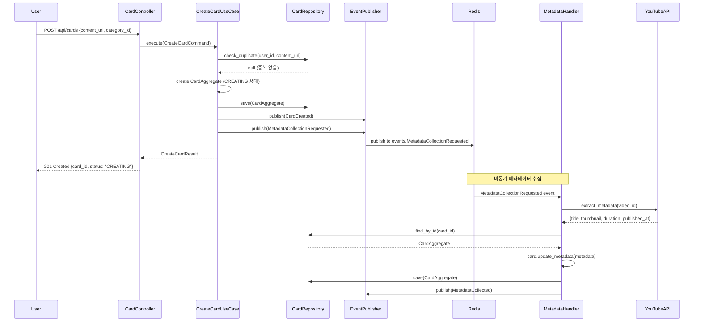
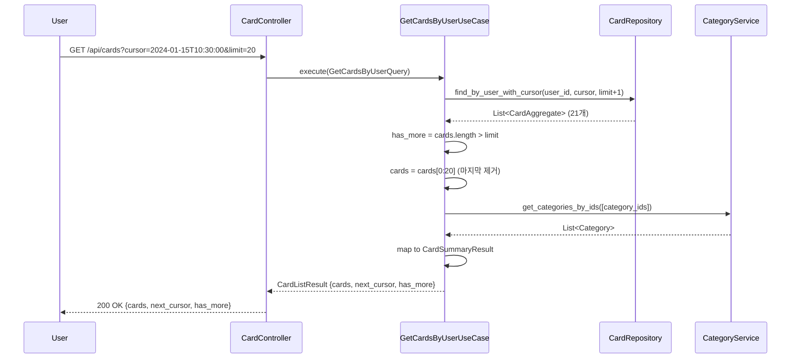
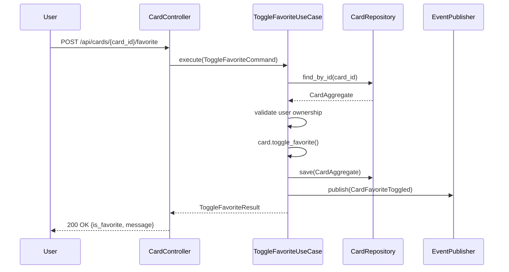
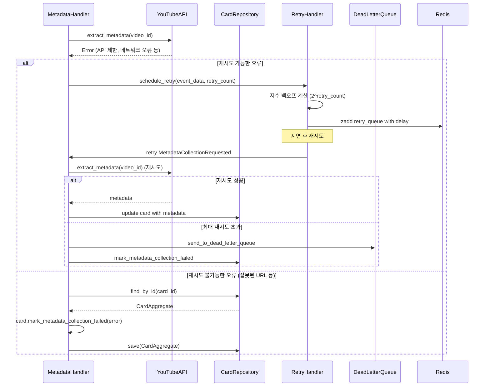
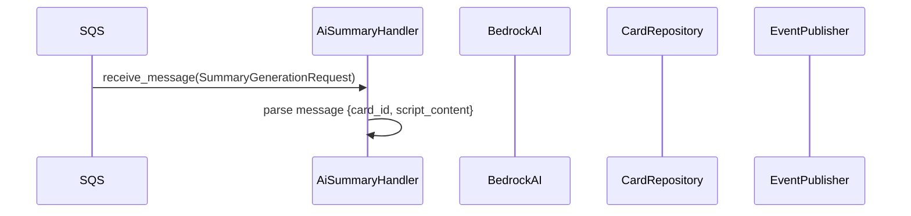
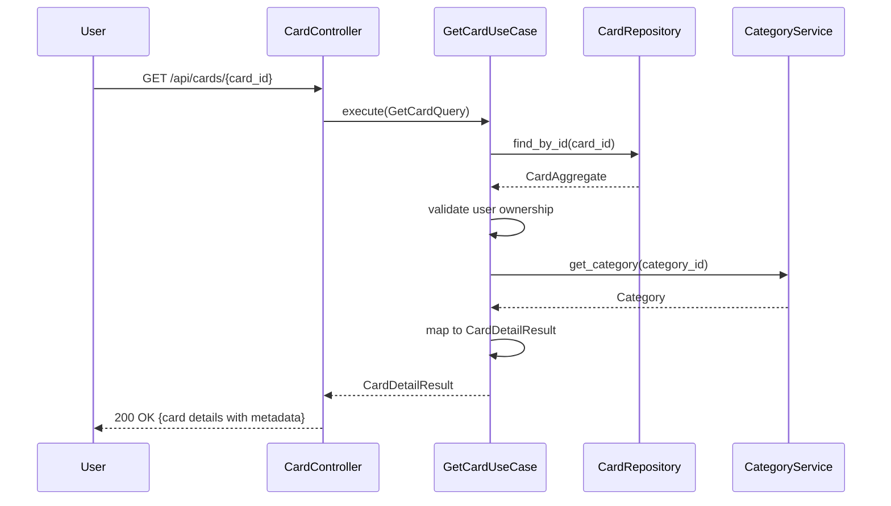
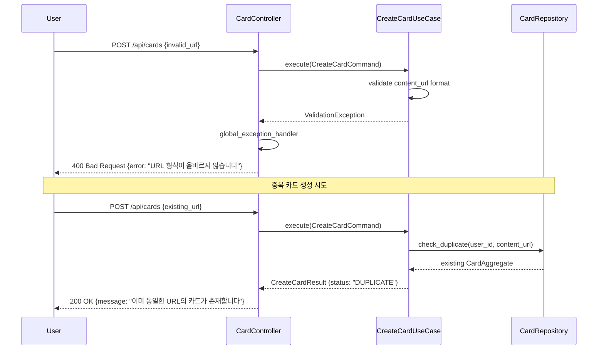
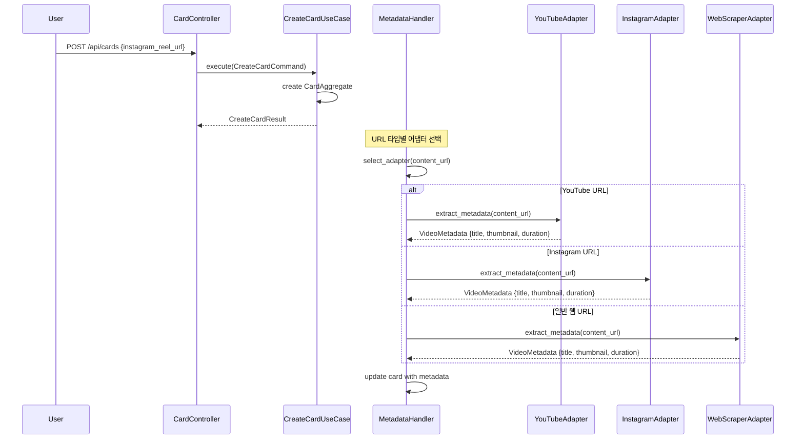

# Unit3: Card Creation & Management - 시퀀스 다이어그램

## 1. 카드 생성 플로우

## 2. 카드 목록 조회 (커서 기반 페이지네이션)

## 3. 즐겨찾기 토글

## 4. 메타데이터 수집 실패 처리

## 5. AI 요약 생성 플로우

## 5. 카드 상세 조회

## 6. 오류 처리 시나리오

## 7. 다중 플랫폼 지원 (확장)

이 시퀀스 다이어그램들은 Unit3의 주요 플로우와 오류 처리, 확장성을 보여줍니다. 비동기 처리, 재시도 로직, 다중 플랫폼 지원이 명확히 표현되어 있습니다.
