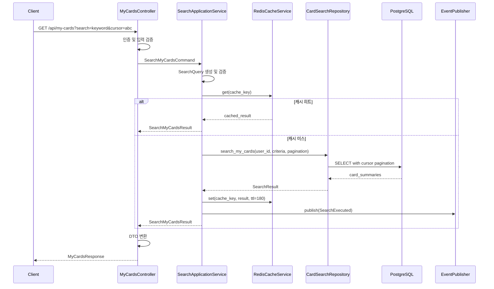
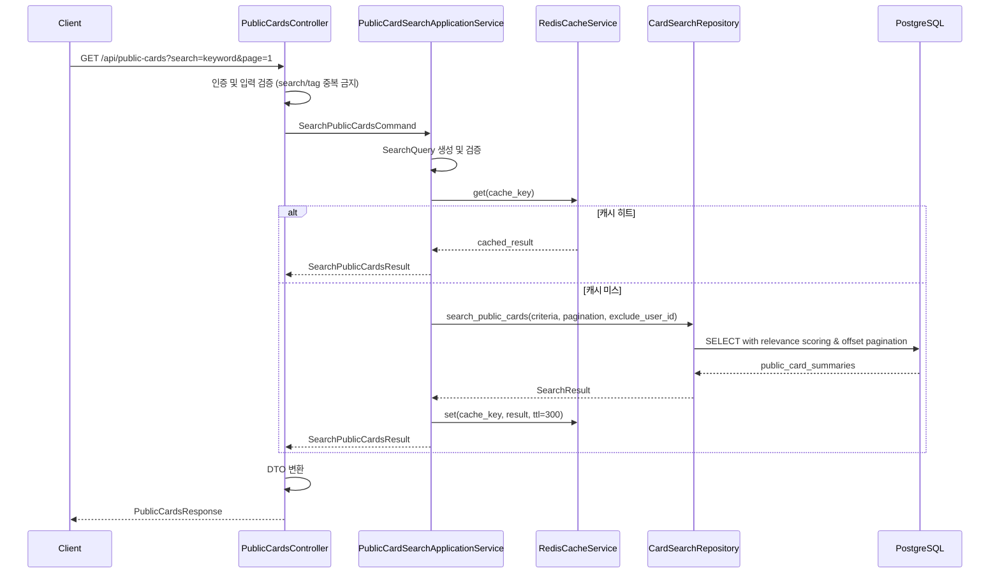
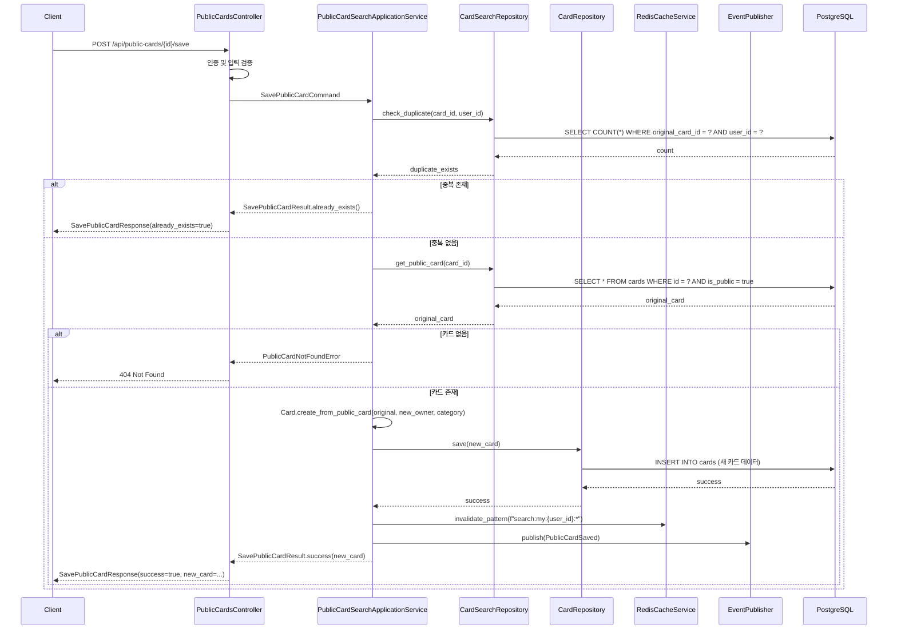
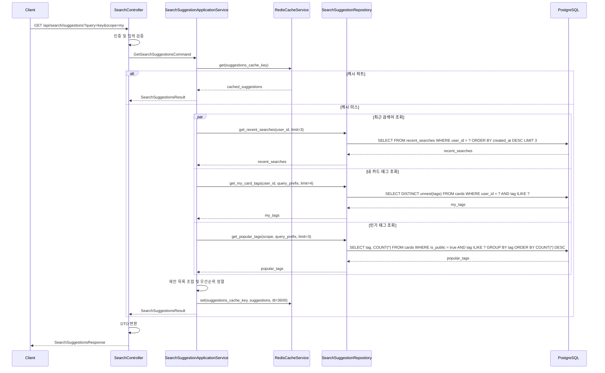
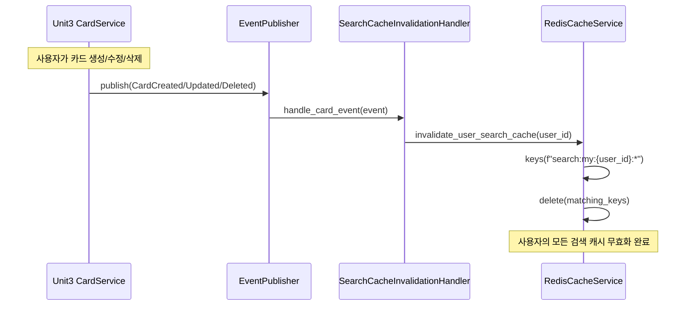
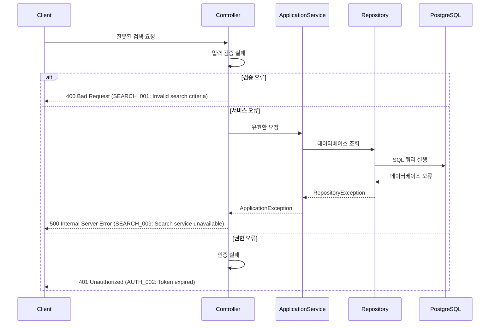

# Unit4: Card Search & Display - 시퀀스 다이어그램

## 1. 내 카드 검색 시퀀스

## 2. 공개 카드 검색 시퀀스

## 3. 공개 카드 저장 시퀀스

## 4. 검색 제안 시퀀스

## 5. 캐시 무효화 시퀀스

## 6. 오류 처리 시퀀스

## 시퀀스 다이어그램 요약

### 주요 특징
1. **하이브리드 페이징**: 내 카드(커서) vs 공개 카드(오프셋) 방식 분리
2. **계층적 캐싱**: 3분/5분 TTL + 사용자별 무효화
3. **독립적 카드 복사**: 공개 카드 저장 시 완전히 새로운 카드 생성
4. **실시간 제안**: 최근 검색어 + 내 태그 + 인기 태그 조합
5. **이벤트 기반 캐시 무효화**: Unit3 카드 변경 시 자동 캐시 갱신

### 성능 최적화 포인트
- 캐시 우선 조회로 응답 시간 단축
- 병렬 처리로 검색 제안 성능 향상
- 인덱스 최적화로 데이터베이스 쿼리 성능 향상
- 패턴 기반 캐시 무효화로 일관성 보장
