# Unit5: Card Sharing - 시퀀스 다이어그램

## 개요
Unit5 Card Sharing의 주요 API별 시퀀스 다이어그램을 Mermaid 형식으로 제공합니다.

## 1. 공유 링크 생성 (US-011)

### 1.1 정상 케이스
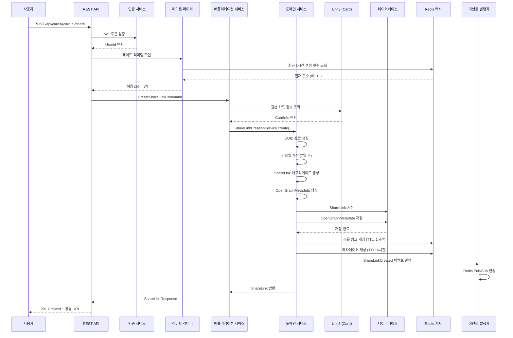

### 1.2 레이트 리미팅 초과 케이스
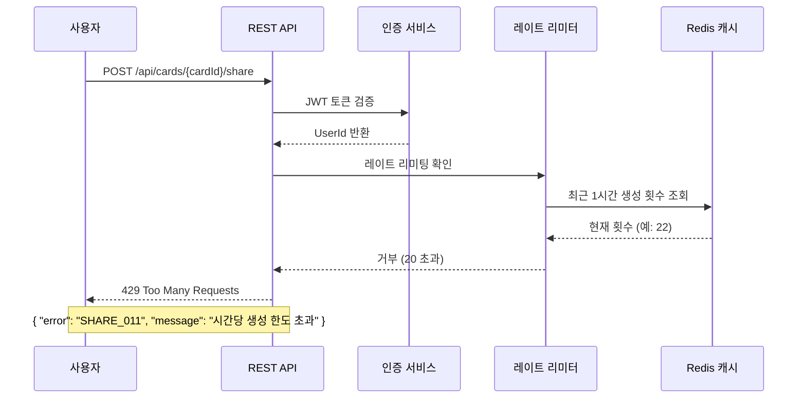

## 2. 공유 카드 조회 - 익명 사용자 (US-012)

### 2.1 정상 케이스 (일반 브라우저)
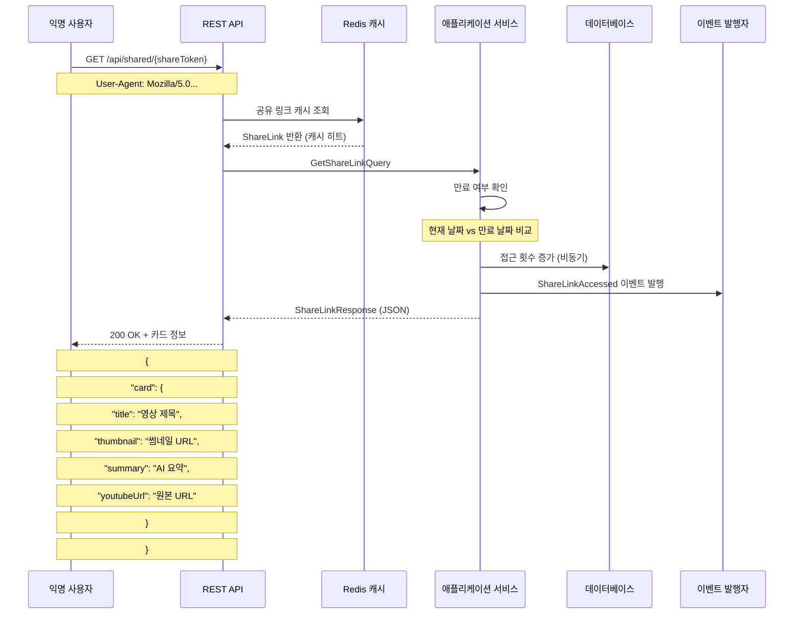

### 2.2 메신저 크롤러 케이스
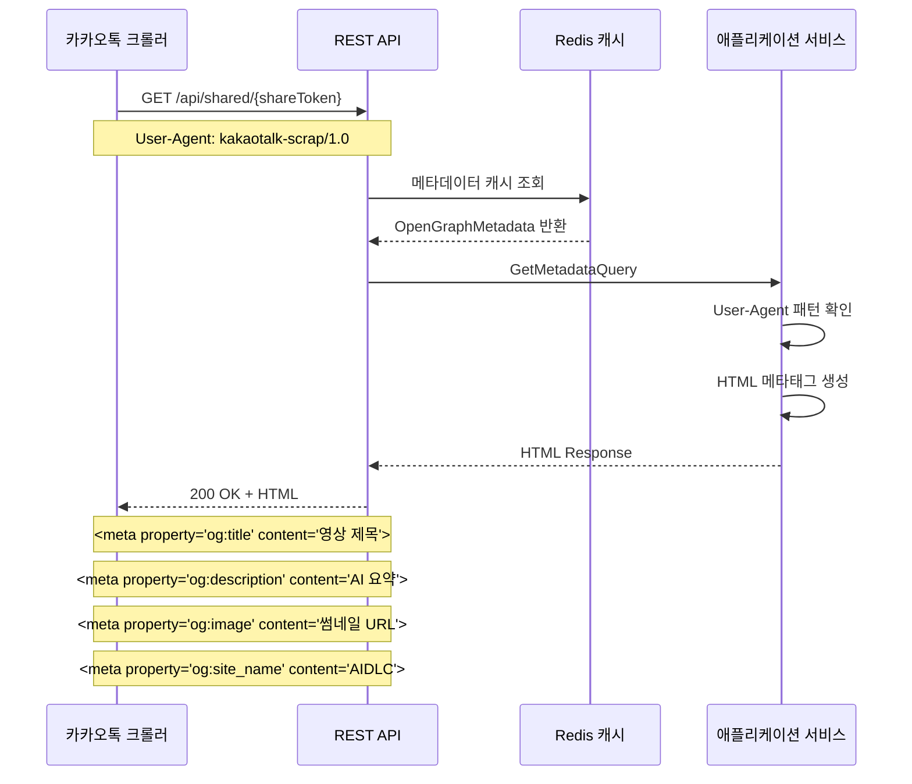

### 2.3 만료된 링크 케이스
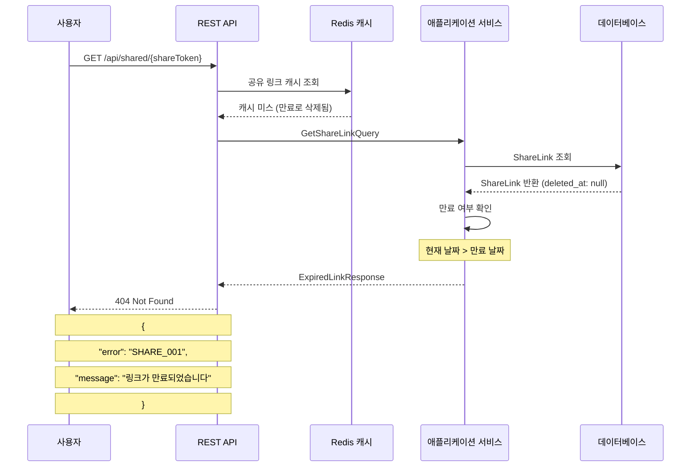

## 3. 공유 카드 조회 - 인증된 사용자 (US-012)

### 3.1 정상 케이스 (자동 저장 포함)
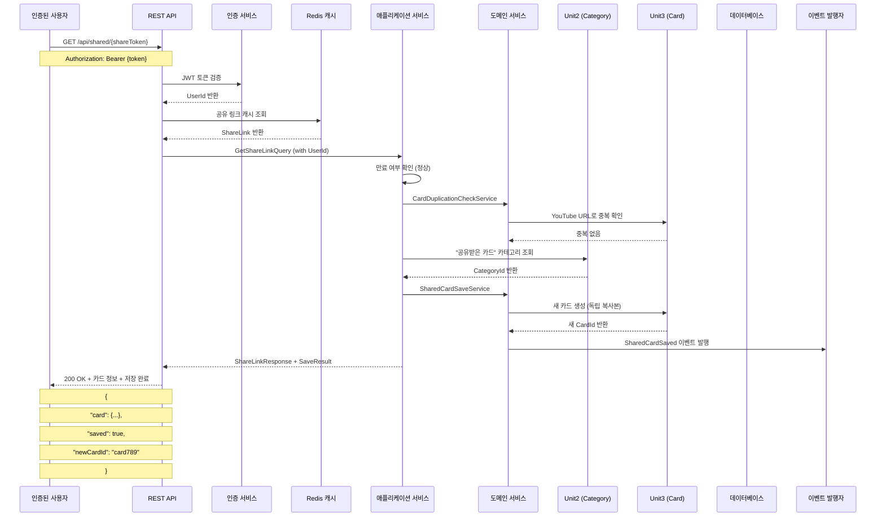

### 3.2 중복 저장 시도 케이스
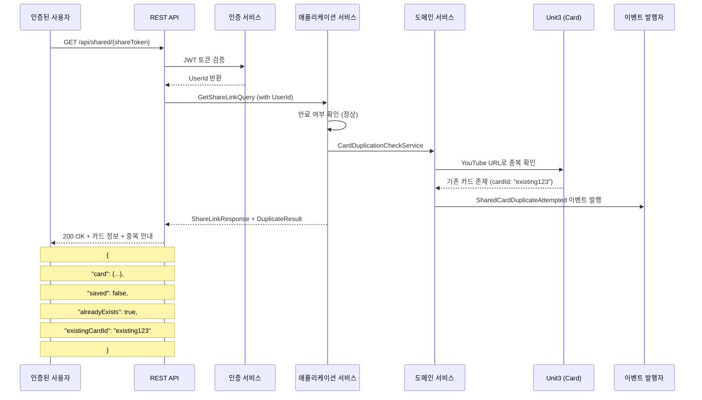

## 4. 공유 카드 자동 저장 (US-012)

### 4.1 별도 API 호출 케이스
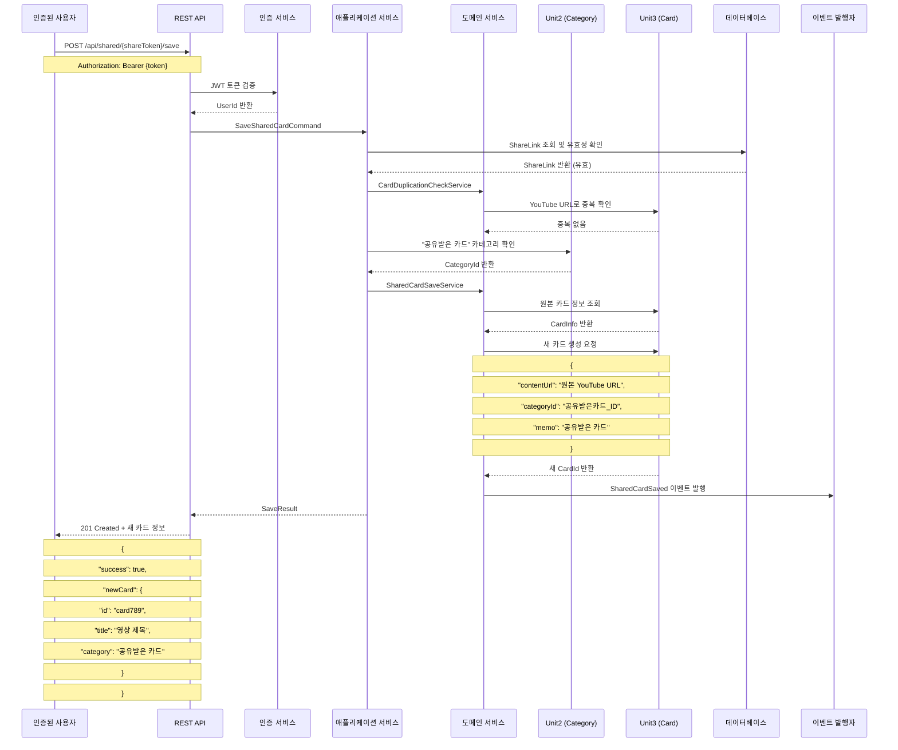

## 5. Open Graph 메타데이터 제공

### 5.1 활성 링크 메타데이터
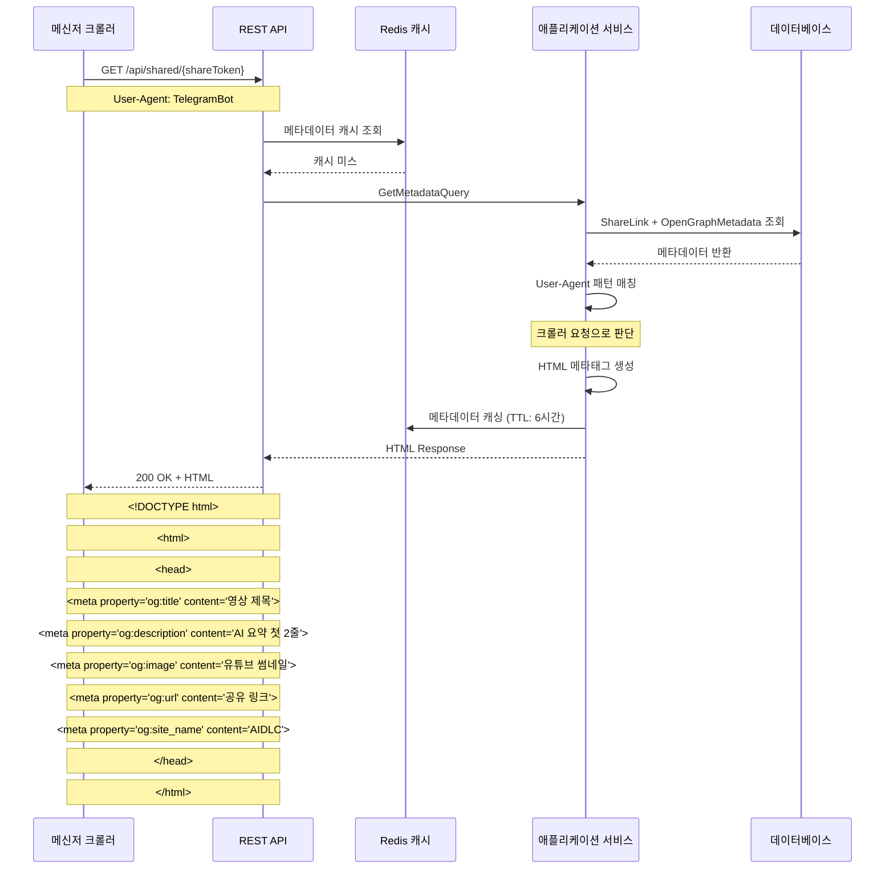

### 5.2 만료/삭제된 링크 기본 메타데이터
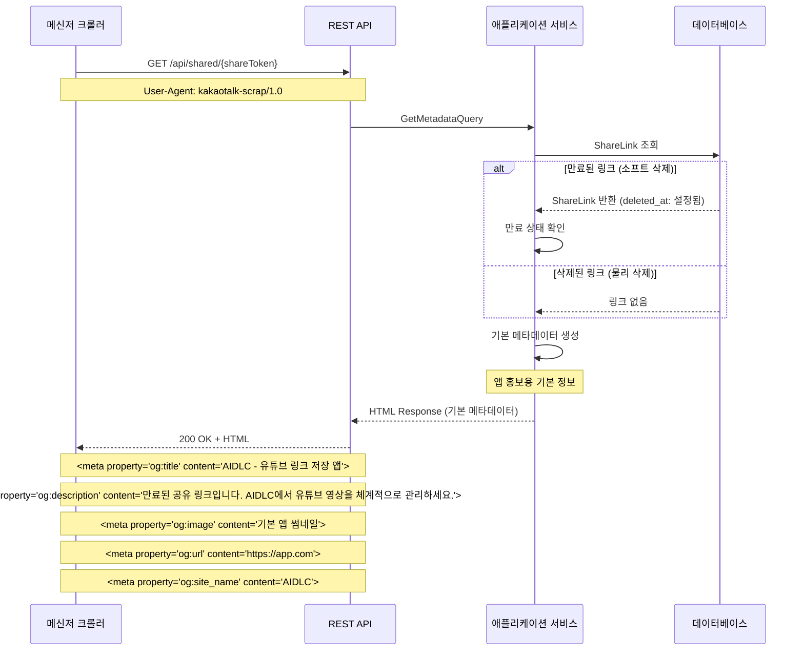

## 6. 배치 정리 작업

### 6.1 만료된 링크 소프트 삭제
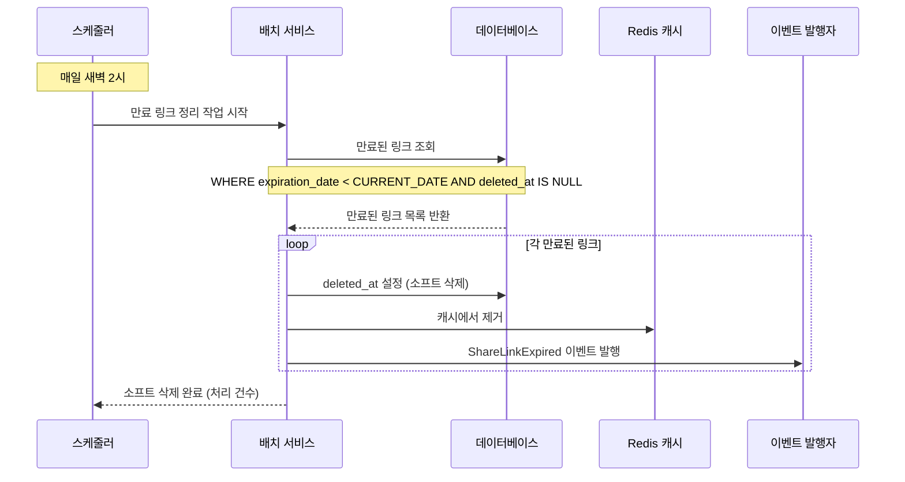

### 6.2 오래된 링크 물리 삭제
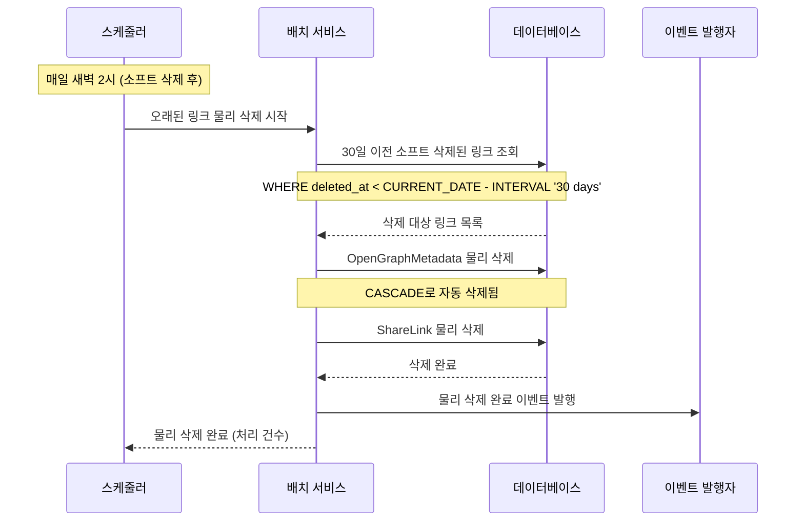

## 시퀀스 다이어그램 요약

### 주요 플로우
1. **공유 링크 생성**: 레이트 리미팅 → 카드 검증 → 링크 생성 → 캐싱 → 이벤트 발행
2. **익명 조회**: 캐시 조회 → 만료 확인 → 응답 (JSON/HTML 구분)
3. **인증된 조회**: 토큰 검증 → 중복 확인 → 자동 저장 → 이벤트 발행
4. **메타데이터 제공**: User-Agent 구분 → HTML 메타태그 생성 → 캐싱
5. **배치 정리**: 소프트 삭제 → 물리 삭제 → 이벤트 발행

### 성능 최적화 포인트
- Redis 캐시 우선 조회
- 비동기 이벤트 처리
- 접근 횟수 업데이트 분리
- 메타데이터 장기 캐싱

### 오류 처리 패턴
- 레이트 리미팅 초과 시 즉시 차단
- 만료된 링크의 우아한 처리
- 중복 저장 시도의 친화적 안내
- 삭제된 링크의 기본 메타데이터 제공
